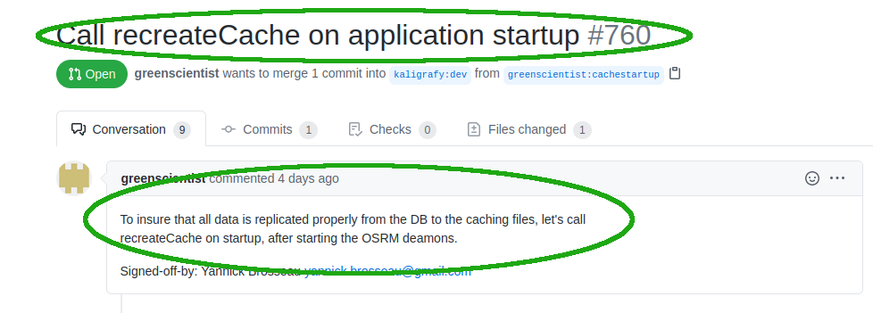
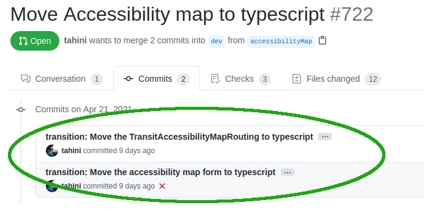
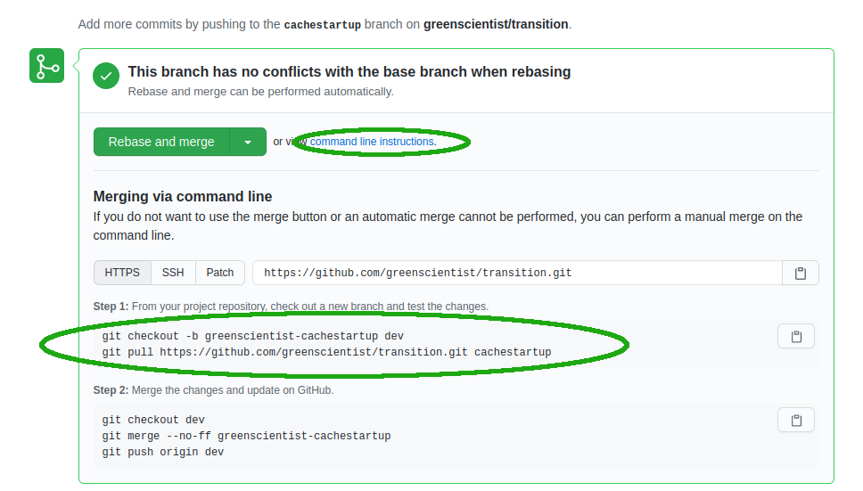
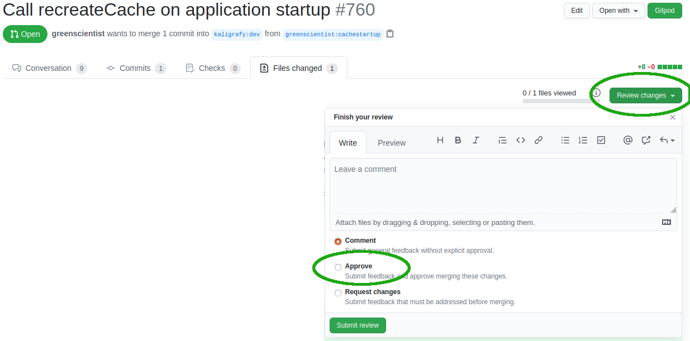

This document explains the why and hows of pull requests in the context of Transition. There are many good documentations out there on [git](https://git-scm.com/book/en/v2) or on [good practices for pull requests](https://www.atlassian.com/blog/git/written-unwritten-guide-pull-requests). The current document just explains how to handle it in the specific context of Transition.

- [Why Pull Requests](#why-pull-requests)
- [How to Create a Pull Request](#how-to-create-a-pull-request)
- [How to Edit a Pull Request](#how-to-edit-a-pull-request)
- [How to Review a Pull Request](#how-to-review-a-pull-request)
  - [Review the PR itself](#review-the-pr-itself)
  - [Code review](#code-review)
  - [Functional review](#functional-review)
  - [Accept and merge](#accept-and-merge)

## Why Pull Requests

* Pull request abbreviation is PR, which can also stand for Peer Review. In an app such as Transition, a single seemingly trivial small change can have impacts in area of the application unsuspected. More eyes can spot and try different things and see problems. Besides, even the best programmers make typos. We want to avoid the next commit being `transition: fix typo`! :p  The more unit and integration tests there is, the more chances most errors will be caught by the test, but until we have a high coverage, more testers are necessary.

* A basic CI is run for all PRs, making sure unit tests and linter pass. This avoids commits in the main branch saying `transition: fix tests`!

* Basic code quality assurance: We are all responsible for the quality of the code. Are there enough comments? is the new feature well documented? Can someone else understand the new changes? etc.

## How to Create a Pull Request

Select the "Pull requests" tab.

Click the green "New pull request" button in the top right corner.

Select both the head and target branches.

Click the green "Create pull request" button in the top right corner.

## How to Edit a Pull Request

To edit the code within a pull request, simply push the changes to the head branch. The PR will then update the code itself. Alternatively, if changes are big enough, you can create a new branch and create another pull request from the new branch into the branch you wanted to merge into main.

To edit the description and other information about the pull request, click the "Edit" button in the top right corner.

## How to Review a Pull Request

So the PR was created and you've been asked to review it! What to do??? There are many approaches to reviewing a patch. As someone becomes used to it, it may vary. But here's the checklist for starters:

Note that ***these are guidelines***, some patches may not require to do all proposed steps!

### Review the PR itself

- [ ] **Do I understand what it does?**
- [ ] **Is the title explicit enough?** If not, single commits should be, see the below point.
- [ ] **Are individual commits explicit enough?** If multiple commits, are each independent of the other with an explicit commit message? (Please no chain of `wip`, `going to sleep now`, etc)
- [ ] **Is the PR logically sound and standalone?** A single PR should not try to do too much. It should have a single logical purpose. If it is too big, don't hesitate to ask to divide it in smaller PRs.

Don't go any further if this part is not right, you'll have trouble reviewing it. Make comments on the PR so the author will review the work.

Examples of views of PRs to review at this step:

### Code review

Next is the code review itself. Behavior is one thing, code quality is another. In this step, we want to make sure the code under review reaches the current standards of code in the various workspaces, and also that the proposed solution makes sense.

- [ ] **Does the code respect the code style?** You can just run `yarn format` on the repo and see if any file was changed. If so (and it is related to the patch), you should ask the author to apply the format to all the commits.
- [ ] **Is the code well documented?** Is there sufficient documentation on the new code? Some claim good programming does not need comments. Make sure the absence of comments is a sign of good programming (variable names, simple obvious statements). In the case of Transition, specific algorithms do need documentation for non domain specialists.
- [ ] **Is the proposed solution architecturally sound?**: This is the more technical part, where you decide if the proposed solution makes sense, is well developped and fits in the long term development plan of the application.
- [ ] **Are there unit tests?** If not, could there be? If it would be quite easy to add some tests, don't hesitate to ask for some.

### Functional review

***This step may not be necessary. As the test coverage increases, it will be less and less required.***

***To do when:***

- [ ] The code touches important core parts, is not well tested and may have side effects.
- [ ] The author specifically mentioned to test some specific thing.
- [ ] There is some behavior change that requires validation by maintainers.

If functional review is required, here are the steps to follow:

- [ ] **Get the code**: There are instructions at the bottom of the PR to get the code. Click on the `command line instructions` link beside the green Merge button. See screenshot below. Refuse if there are conflicts with `dev`.

- [ ] **Compile and run**: Make sure it all compiles correctly in your environment: In one window: `yarn && yarn compile && yarn build:dev`. In another window: `yarn start:json2capnp`. In yet another window: `yarn start`.
- [ ] **Test the new code**: **Thoroughly** try the feature impacted by the PR: don't just do the basic stuff, try corner cases, all fields, try with different data (as much as you can). We want to be sure the behavior is as expected! Look at the console messages for any errors. Report anything out of ordinary, comment its behavior, etc.
- [ ] **Test for regressions**: Until we have good unit test coverage to do it instead of us, briefly also make sure it did not impact anything else, especially if modules in chaire-lib were modified. Report anything out of ordinary.

### Accept and merge

So all the PR checks are OK, I'm ready to approve and merge! But wait, there are still steps to do here!

- [ ] **Did I approve the PR?**: In the `Files changed` tab of the PR, click on the green `review changes` button and select `Approve` and submit.

- [ ] **Did all reviewers approve?**: If anyone was specifically requested for review, make sure the review was done and approved (or that there is no need). In doubt, just ping the other reviewer(s) for comments.
- [ ] **Were all comments addressed?**: If other reviewers requested changes, make sure they were all addressed (or are outdated).
- [ ] **Does the PR need other pairs of eyes?**: If the PR touches areas of code for which other reviewers are best qualified to validate, don't hesitate to request a review from them before merging, even if you think it's ok, especially for larger complex pull requests.