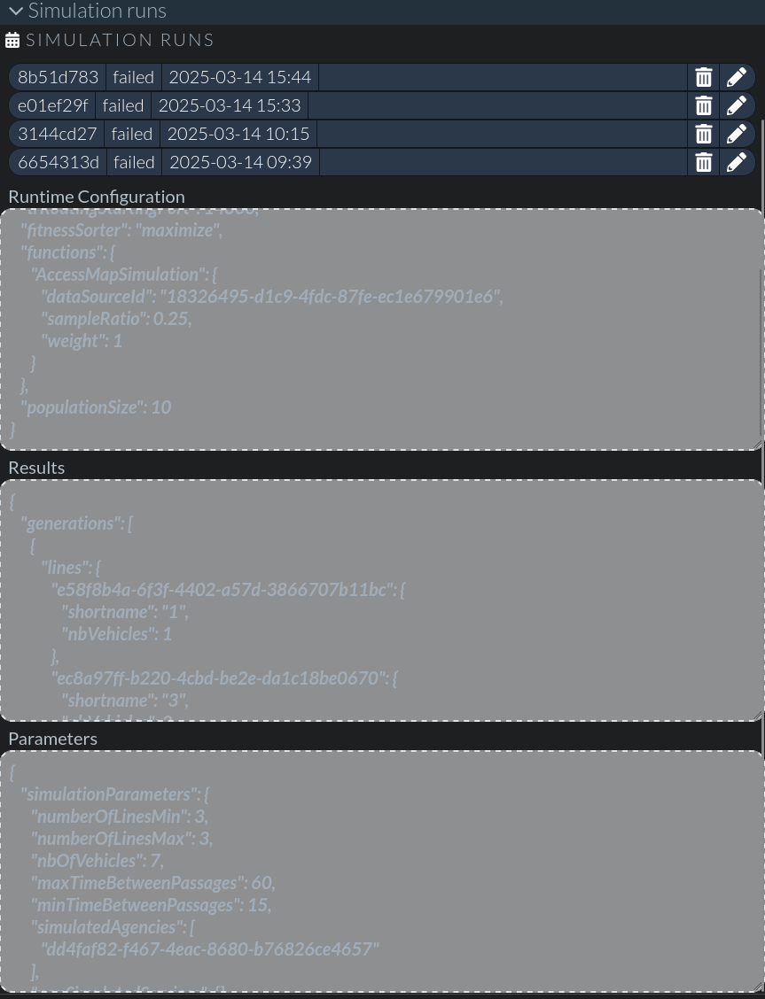

# Simulations (aka Transition's evolutionary algorithm)

These instructions explain how to run the evolutionary algorithm in Transition. It is still very experimental and require manual manipulations. This algorithm picks from a set of many transit paths and schedules, the subset that offer the "best network performances", given certain parameters. The following publication used and analyzed the performance of the algorithm with real small/medium city use cases: [Transit network design using a genetic algorithm with integrated road network and disaggregated O–D demand data](https://link.springer.com/article/10.1007/s11116-019-10047-1).

The genetic algorithm runs on a specific *simulation*. A simulation specifies the parameters to simulate, for example the number of lines, the number of vehicles, minimal/maximal interval, etc.

## Enable the simulation section of Transition

Simulations can be defined in Transition's user interface. First the section should be enabled (it is disabled by default). Make sure you have the following configuration in Transition's config file:

```
sections: {
    simulations: {
        enabled: true
    }
}
```

## Define a simulation

The `Simulations` section should now be available from the interface.

Click on the `New simulation` button to create a new simulation.


Give the simulation a name, then define the parameters. They are divided into 3 categories:

### Simulation parameters

They define the expected resulting network. You can select

* The minimum/maximum number of lines that the resulting network should have
* The minimum/maximum period in minutes between vehicle passages
* The number of vehicles available in the fleet to run the network
* The agency containing the various lines and paths to select from. Currently, Transition cannot generate lines automatically, so running the evolutionary algorithm requires to manually create many many lines covering the area of interest, from which the algorithm will pick the best combination. This should be done prior to running the simulation.
* The lines in this agency that should always be part of the network
* The services (possibly from other agencies) to add to the simulation. For example, if working on the network for a small area (for example a suburb), but the simulated data involves routing people to other places (like downtown), the other services in the larger area can be added to the simulation to better integrate the new service with current, unchanged ones.

### Algorithm configuration

Depending on the selected algorithm, various parameters can be configured. The only algorithm available so far is "Genetic algorithm with lines and number of vehicles".

This algorithm works by comparing various variations of the network at each generation. At first, each variation, the *chromosome*, is randomly configured by activating a certain number of lines, the *gene*, as configured from the available lines. The schedules are configured to match the parameters of desired period and number of vehicles. Each chromosome is then rated according to a fitness function (more on that later, in the *Fitness function* section). A number of elites can be kept for the next generation.

The parameters to configure are

* Minimum and maximum population size, ie the number of chromosomes to compare at each generation.
* The number of elites to keep between generation, as well as the number of entirely new random chromosomes to generate
* 

### Routing parameters

These parameters define the routing values to use for transit calculations. The fitness functions involve either route calculations or accessibility comparisons using transit. The parameters thus define what to use for those calculations:

* Total travel time
* Minimum waiting time at stops: typically 3 minutes
* Maximum access/egress times and transfer time
* Maximum first waiting time

The following screenshot shows an example of a simulation parameter definition.


## Fitness function

To compare various variations of the network, a fitness function is used. There are 2 available fitness function for the evolutionary algorithm: OD trips and accessibility maps. Each one requires preparing the data sources to use in the simulations.

The chromosomes can also be compared using a mix of those methods, the weight of each can be set at runtime. For example, it would be possible to give a fitness mark that would correspond 75% to the accessibility map method and 25% OD trips, to give more weight to accessibility than current trip routings.

### By OD trips

This fitness function requires an OD trips datasource to be available in Transition. THERE IS CURRENTLY NO WAY TO IMPORT THAT IN TRANSITION!!! See [this issue](https://github.com/chairemobilite/transition/issues/1288) for a workaround to import some.

This method will take a sample of the od trips in the data source and calculate the route between each OD pair. For each pair, it will calculate a cost for this route (multiplied by the expansion factor of the odTrip, which is 1 if imported from a batch file and since it's the only way to import od trips, it's 1!). The costs for all trips will be summed and the result is the fitness of the network.

In case of no result for a route calculation, the cost of a 'taxi' ride is used. The cost, fitness and non-routable functions are defined in the `defaultPreferences.config.ts` file, under `simulations` -> `geneticAlgorithms`. They should probably not be a preference, but a config somewhere, with defaults in the code itself.

The goal is to minimize the cost with this method.

*Note*: The odTrip routing, the way this algorithm is implemented, still uses the v1 endpoint from trRouting (the odTrip datasources has the advantage that all accessible nodes are cached for each OD pair, simplifying the calculations, and there's a lot of calculations). Since it is not supported in trRouting since commit 50418c0f, you need to use a version of trRouting prior to that. The last commit supporting v1 is c9d03a44. This algorithm is implemented in the `OdTripSimulation.ts` file in `transition-backend/src/services/simulation/methods`.

### By accessibility maps

This method implies to count the number of points of interest accessible by transit from different locations. This requires a datasource of places in Transition.

Data for a given data source can be fetched from OpenStreetMap. Some command lines are available to facilitate the import of this data.

But first, prepare the data source directory in the runtime's `imports` folder. For example, for data source named `villeray`, make sure you have the following file hierarchy:

```
<Transition runtime dir>/
 |-- imports/
    |-- villeray/
       |-- polygon.geojson
```

First, a `polygon.geojson` file containing a GeoJSON polygon that defines the area of the data to import needs to be available in the data source directory. [geojson.io](https://geojson.io) can be used to create one.


The following steps need to be done to prepare the data: 

*Note*: all those steps can be done non-interactively, ie by passing each parameter on the command line. But in the absence of a proper way for tasks to announce their parameters and the lack of documentation for it, the current approach is to read to code and find out (and update this documentation!) or run it interactively. A frequent parameter is to use `--dataSourceId <name of data source>` that works on most tasks.

1. Download the data from open street map:

```
$ yarn node packages/chaire-lib-backend/lib/scripts/osm/1_downloadOsmDataToFiles.task.js
yarn node v1.22.22
Using .env file from ./.env
Read server configuration from ./examples/config.js
? Please select a data source for import (Use arrow keys)
❯ villeray 
  --New data source--
? Please select a data source for import 
Retrieving data from osm...
Done retrieving data from osm...
Writing osm data to runtime/imports/villeray/osmRawData.json
Done writing osm data
Retrieving data from osm...
Done retrieving data from osm...
Writing osm geojson data to runtime/imports/villeray/osmData.geojson
Done writing osm geojson data
```

2. (optional) Enhance the polygon data. It adds the polygon area in sq meters, for polygons, it calculates the area and the floor area using the building:levels value and the calculated area, or it takes the existing floor area from the building:floor_area tag, which is supposed to be in sq meters.
```
yarn node packages/chaire-lib-backend/lib/scripts/osm/1b_prepareAndEnhanceOsmPolygonData.task.js
? Please select a data source for import (Use arrow keys)
❯ villeray 
  --New data source--
Running import in dir runtime/imports/villeray/
Enhancing and saving polygon geojson data to file:  runtime/imports/villeray/osmPolygonsEnhanced.geojson
Fetch buildings from osm geojson data...
There are 16103 buildings in the osm geojson data.
Fetch polygons and multipolygons from osm geojson data...
=== validated and enhanced polygon 16970 ===
Finished with 16971 polygons.
```

Note that this step runs in `O(n^2)`, which means that the larger the area, the longer the task, and it may take a very long time to town or city-scale areas.

3. Import and process osm data to files. This will create 3 geojson files, one for points of interest, one for residential buildings and one for residential zones. This task will give a number of warnings on buildings and places that may have missing or incomplete data and for which an approximation is used. It is worth running this task in non-interactive mode and pipe the output to a file for later fixing/editing the OpenStreetMap data to fix the warnings.

```
yarn node packages/chaire-lib-backend/lib/scripts/osm/2_importAndProcessOsmDataToFiles.task.js --dataSourceId villeray > outputFile.txt
```

Note that this step runs in `O(n^2)`, which means that the larger the area, the longer the task, and it may take a very long time to town or city-scale areas.

4. (optional) Assign weights to POIs. This will use the "Trip Generation Manual"'s data to give weight to POIs according to their category and the area occupied.

```
yarn node packages/chaire-lib-backend/lib/scripts/osm/2b_assignWeightsToPOIs.task.js
```

5. (optional) Import and validate land role data. This will validate that the number of residences (flats) from openstreetmap matches the land role data and give warnings if it is not the case.

```
yarn node packages/chaire-lib-backend/lib/scripts/osm/3_importAndValidateLandRoleData.task.js
```

This step will ensure that residences in an area are all accounted for. If it is omitted, then the OpenStreetMap residential counts is used (the `flats` and `building:flats` tags), so one should make sure they are accurate for the area under investigation. This only applies if residences count is to be used in the analysis.

6. Then import the geojson places files into the database using the places import script by running the following script, which will add 2 places data sources, one for POIs and one for residential entrances.

```
yarn node packages/transition-backend/lib/scripts/osm/4_importPlacesToDb.task.js
```

The simulation then takes points from the datasource and calculates the other accessible places from this location within the simulation parameters. Points can have weights (for example, supermarket can have higher weight than local bakery) and their weight is divided by the time to reach this location (places reachable in 10 minutes will have higher weights than those accessible in 60 minutes).

## Run the simulation

Running the simulation is currently done via the command line, so access to the Transition server is required, it cannot be done entirely from the UI.

The command to run for the simulations is as follows, to select the simulation to run:

```
yarn node packages/transition-backend/lib/scripts/simulations/simulation.task.js
? Please select the simulation to run (Use arrow keys)
❯ Test (Genetic algorithm with lines and number of vehicles)
```

It will display the simulation parameters entered in the UI (simulation parameters, algorithm configuration and routing parameters) and invite you to edit the *algorithm configuration* part for this specific run, just clicking enter should be good if the parameters are correct. 

Then it asks for a random seed (to repeat a simulation), you can leave this blank.

Then the number of threads will determine how many threads the trRouting process will use, so how many parallel scenarios (chromosomes) can be analyzed.

The starting port for the trRouting calculation can be configured. It defaults to 14000, but if Transition is a server potentially running batch calculations at the same time, a different port should be used.

```
? Edit algorithm configuration? (y/N) 
? Random seed
? Number of threads (1) 
? Starting port used for trRouting calculations (14000) 
```

The next questions are more towards the fitness functions:

You can select whether to maximize or minimize the cost results once all fitness is calculated for each chromosome

*Note*: I, tahini, have no idea if and how this actually works out, as sort order varies depending on the method. There this TODO in the code: `// TODO The fitness sorter should be specified for each method as fitness order may vary`. This may have been done when we were using only one method? but odTrip method should minimize cost, while accessibility map should maximize, so if using a mix of both, it is not clear how that would work. Testing needed.

```
? Sorting direction of cost results (Use arrow keys)
❯ Maximize (higher value is better) 
  Minimize (lower value is better) 
```

Fitness functions for the simulation can then be selected. One or many can be used. If many functions are used, a weight can be given to each method and the final fitness is calculated as follows, from a comment in the code: `TODO Figure out how to get the totalFitness of a candidate given the results. For now, we use an approach inspired by the climbing Olympic discipline: the totalFitness is the product of the rank of each candidate for each method. The rank of each candidate for each method is defined as the power of the actual rank order and the weight of the method`.

```
? Select functions to use for simulation (Press <space> to select, <a> to toggle all, <i> to invert 
selection, and <enter> to proceed)
❯◯ OD trips
 ◯ Using accessibility maps
? Weight of the cost for simulation function "OD trips" 0.5
```

Then, specific parameters for each methods are asked. 

For the `OD trips` method, it asks the data source to use, as well as the sample ratio to use (for large od trips data source, only a random fraction of the trips can be used to simulate). A ratio of 1 means the whole data source will be used.

Then it asks for the cost function to use to determine the cost of a single od trip result. It can either use the travel time only in the function, or add an extra penalty for transfers.

*Note*: These cost functions are defined in the `defaultPreferences.config.ts` file and should be better documented. For example, the travelTime is multiplied by 10 in the function. 10$/minute? Where does that number come from? And why not penalize with the same cost the initial lost time? Also, the text of the second method says 10 min penalty for transfers, but it seems to be actually 5?

Then, you need to select the cost function for the entire scenario (the fitness used to rank the various chromosomes). It can either be a function of the user cost (as defined by the odTrip cost function?) or the operation cost (to run the fleet for this scenario), or both.

*Note*: These cost functions are defined in the `defaultPreferences.config.ts` file and should be better documented. I, tahini, don't know what else to say here...

```
? Data source for OD (Use arrow keys)
❯ odTrips
? Sample ratio (between 0 and 1)
? Cost function for OD trip result (Use arrow keys)
❯ Travel time
  Travel time + 10 min penalty for transfers
? Cost function for the scenario (Use arrow keys)
❯ User + operating costs (hourly)
  User cost (hourly)
  Operating cost (hourly)
```

For the `Accessibility maps` method, it asks for the data source to use and the maximum sample ratio to use from that datasource.

The sample ratio corresponds to the maximum ratio of the places in the datasource that will be analyzed. For example, a ratio of 0.5 for a data source of 100K places means that at most 50K places will be analyzed. The number of places effectively analyzed for a scenario may be less than that if the results converge sooner, as the dataset of places may be quite large. Places are analyzed in chunks, and each time, the cost function with the new chunk is compared with the preceding one. If the variation is less than 1% (low variability threshold, not configurable yet, but marked with a TODO) for more than 2 groups in a row, the calculation stops.

```
? Data sources for places
❯ villeray Places
  villeray Residences
Maximum sample ratio to test (between 0 and 1)
```

After all the parameters are entered, the simulation starts running. It first creates various level of services for each line, given the number of vehicles and the interval between passages. Then candidates are randomly selected by selecting a number of lines and assigning to each a certain level of service.

If the lines and simulation parameters are properly configured, it will run each iteration. At the end of the simulation, the best services and scenarios are saved and can be viewed from the Transition interface.

*TODO*: Document this part a bit more. I, tahini, do not have data currently to run a simulation and thus am unable to document this better.

## View the results

Once the simulation has been run, the results are available from the UI, in the `Simulations` tab, by expanding the `Simulation runs` section. Clicking the edit button will simply output the json configuration, parameters and results in text boxes.



If the simulation run succeeds, the winning scenarios of the last few generations are available among the scenarios and services, identified by the simulation run ID and their generation/candidate numbers.
