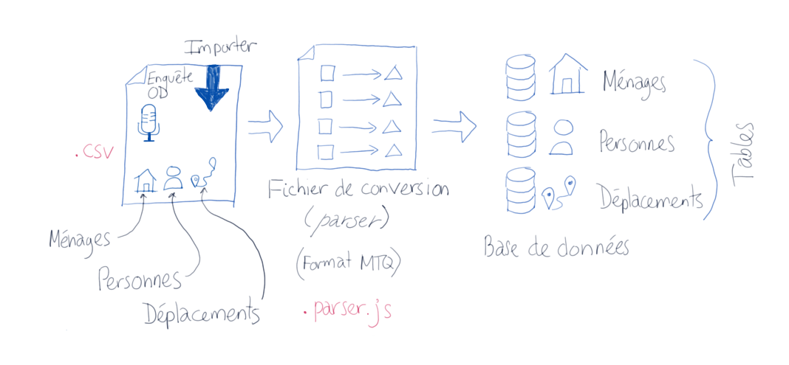
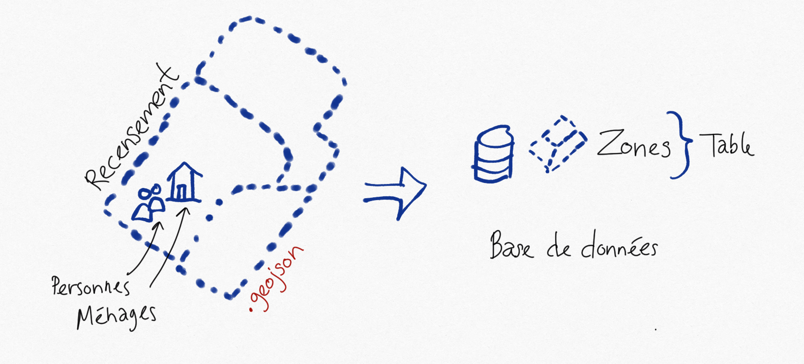
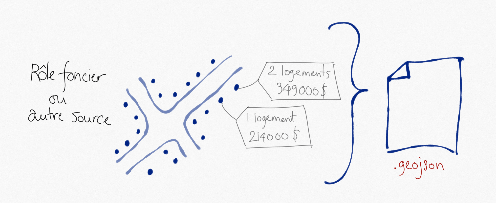
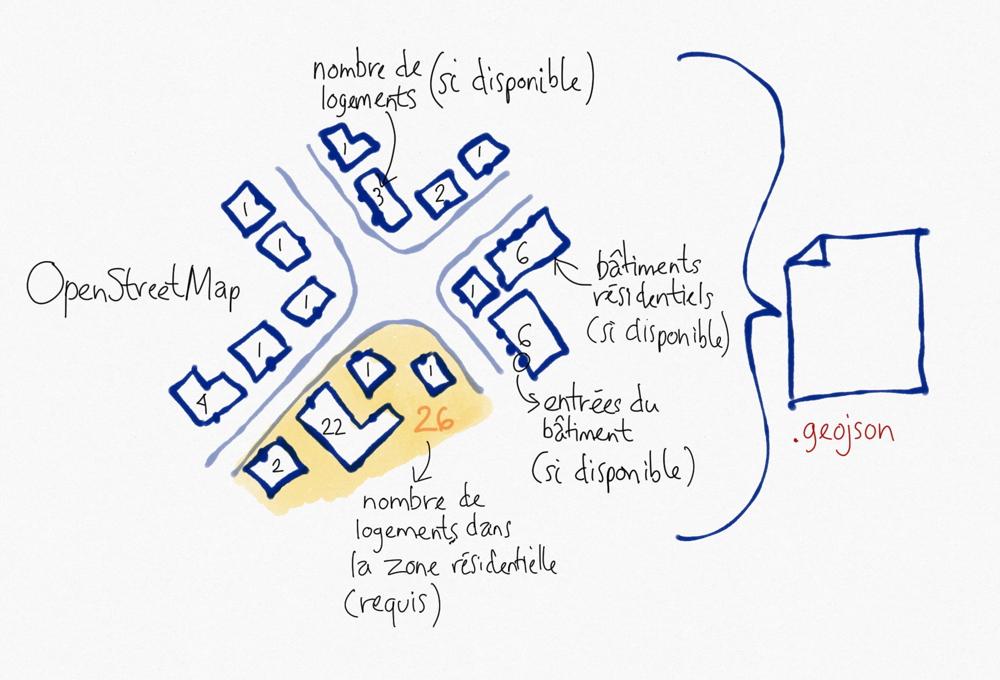
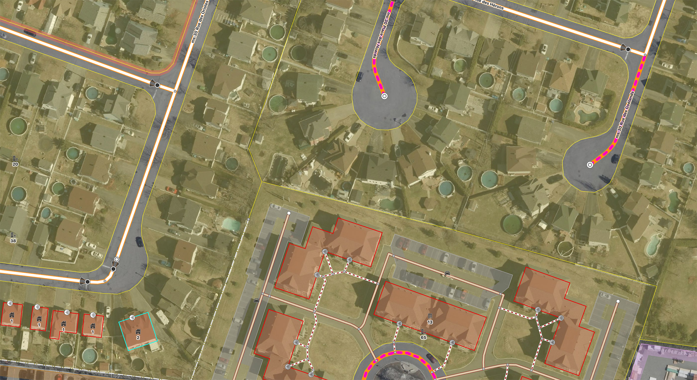
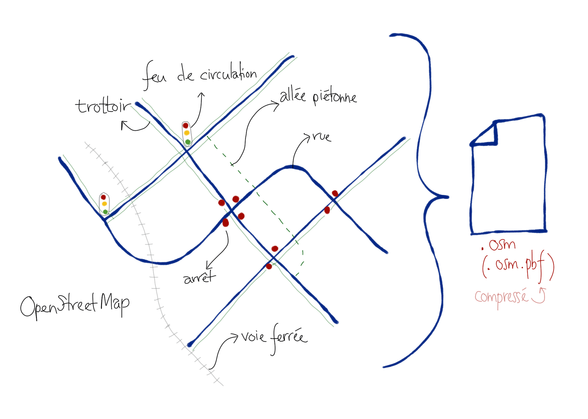
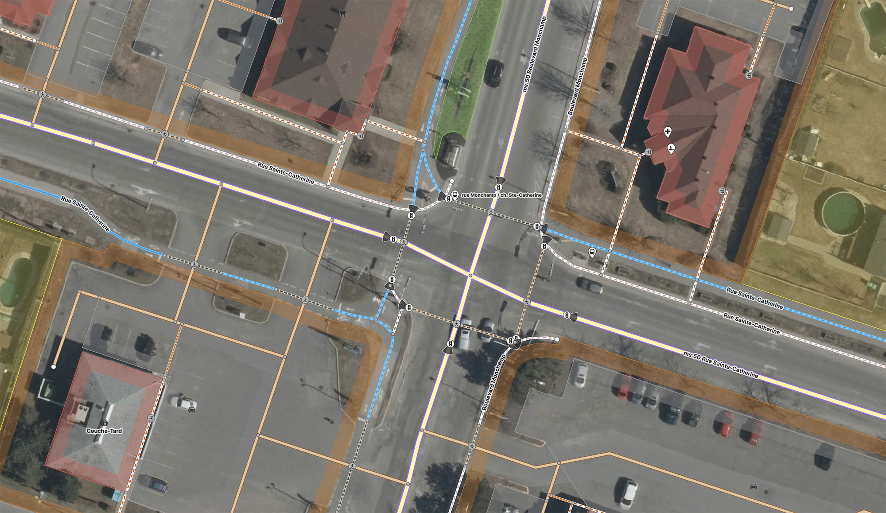
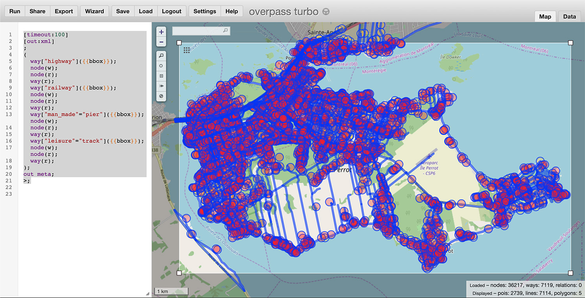

# Méthodologie de synthèse de population

## Importation des données

1. [Importer les données d'enquêtes Origine-Destination](#importODSurveyData)
2. [Importer les données de recensement (ménages et personnes) par zone (au Canada, les zones devraient être les aires de diffusion)](#importCensusData)
3. [Importer la localisation de tous les bâtiments résidentiels (habituellement à partir du rôle foncier)](#importFlatsData)
4. [Importer toutes les données depuis OpenStreetMap pour la région étudiée (noeuds, lignes/ways et relations) en json et geojson](#importOsmResidentialData)
5. [Importer les données des réseaux depuis OpenStreetMap pour la région étudiée (highways/railways)](#importOsmNetworkData)

## Préparation des données

1. [Préparer les données OSRM à partir des données des réseaux d'OpenStreetMap](#prepareOsmNetworkData)
2. Calculer les temps de parcours marche/vélo/voiture des domiciles aux lieux habituels de travail et d'étude pour les personnes de l'enquête OD importée
3. Calculer les temps de parcours marche/vélo/voiture de tous les déplacements de l'enquête OD importée
4. Assigner les zones du recensement aux domiciles de l'enquête OD importée
5. Préparer les données des logements pour génération de ménages

## Génération des ménages

1. Calculer les distributions des différents attributs des ménages dans l'enquête OD importée

# Importation des données

## <a name="importODSurveyData"></a>Importation des données d'enquête OD

* (Incomplet): À compléter




## <a name="importCensusData"></a>Importation des données de recensement

* Préparer les données du recensement (préférablement découpées par aire de diffusion au Canada). Chaque zone de découpage doit avoir comme attributs le nombre de personnes de chaque groupe d'âge, le nombre de personnes par occupation, le nombre de familles/ménages par catégorie de famille/ménage et le nombre de ménages par revenu de ménage
* Générer un fichier geojson de polygones (zones) avec ces données
* Placer ce fichier .geojson dans le dossier *imports* du projet
* Lancer cette [tâche](/packages/chaire-lib-backend/src/scripts/zones/importZones.task.ts): une nouvelle source de données de zones sera créée. Cette source de données comprendra l'ensemble des découpages importés, avec ses attributs de ménages et de personnes



## <a name="importFlatsData"></a>Importation des données de logement
* Préparer les données sur la localisation des bâtiments résidentiels. Chaque bâtiment doit avoir comme attributs le nombre de logements (où seront placés les ménages) et la valeur foncière du bâtiment (qui sera divisée par le nombre de logements pour disperser les ménages selon leur revenu)
* Générer un fichier geojson de points avec ces données
* Placer ce fichier .geojson dans le dossier *imports* du projet



## <a name="importOsmResidentialData"></a>Importation des données résidentielles d'OpenStreetMap
Obtenir les données résidentielles d'OpenStreetMap, incluant:
  * zones résidentielles découpées autour des rues avec nombre de logements dans la zone: attribut *flats* (requis pour validation de la compatibilité du nombre de logements provenant des données de logement de l'étape précédente)
  * bâtiments avec nombre de logement: attribut *building:flats* (facultatif mais fortement recommandé pour attribuer les valeurs foncières aux bons bâtiments)
  * entrées d'accès (facultatif mais fortement recommandé pour les calculs de chemin pour les accès piéton)




### Procédure détaillée d'importation
  * Générer un polygone geojson de la région à importer et convertir en format .poly en utilisant la requête REGEX suivante avec l'attribut geometry.coordinates: ```\[ ([0-9.-]+), ([0-9.-]+) \],? ?``` => ```$2 $1 ```. Attention, les coordonnées dans un geojson sont dans l'ordre lat/long, alors que le .poly d'openstreetmap s'attend à long lat.
  * Utiliser https://overpass-turbo.eu/ et utiliser la [requête suivante](/docs/poisAndPopulationSynthesis/overpassQueries/residential_buildings_with_entrances.qlquery)
  * Remplacer la variable *polyboundary* par le polygone de la région au format .poly obtenu précédemment. Par exemple ```{{polyboundary="45.3986 -73.9925 45.3915 -74.0050 45.3852 -74.0024"}}```
  * Exporter au format json à partir de Overpass (*Run* puis *Export*, puis *download/copy as raw OSM data*)
  * Placer ce fichier .json dans le dossier *imports* du projet
  * Utiliser https://overpass-turbo.eu/ et utiliser la [requête suivante](/docs/poisAndPopulationSynthesis/overpassQueries/residential_buildings_with_zones.qlquery)
  * Remplacer la variable *polyboundary* par le polygone de la région au format .poly obtenu précédemment
  * Exporter au format geojson à partir de Overpass (*Run* puis *Export*, puis *download/copy as GeoJSON*)
  * Placer ce fichier .geojson dans le dossier *imports* du projet

## <a name="importOsmNetworkData"></a>Importer les données des réseaux d'OpenStreetMap
Obtenir les données des réseaux routiers, piétonniers, cyclistes et ferroviaires d'OpenStreetMap, incluant:
  * Routes et rues de toutes catégories
    * Autoroutes
    * Troncs
    * Route primaires
    * Routes secondaires
    * Routes tertiaires
    * Rues résidentielles
    * Rues non classifiées
    * Rues de services (accès, allée de stationnement, etc.)
    * Routes réservées aux bus et véhicules de transport collectif
    * Ruelles
    * Trottoirs (facultatif, mais fortement conseillé pour une meilleure précision)
    * Allées et rues piétonnes
    * Traverses de rues
    * Sentiers
    * Pistes cyclables
    * Autres accès piéton (escaliers, trottoirs d'accès, traverses de stationnement, quais, etc.)
  * Attributs des routes et rues
    * Limites de vitesse
    * Nombre de voies et voies de virage (facultatif, non pris en compte dans la synthèse de population et les calculs de chemin pour l'instant)
    * Interdictions de virages
    * Feux de circulation (positionnés aux lignes d'arrêt pour chaque direction)
    * Panneaux d'arrêt (positionnés aux lignes d'arrêt pour chaque direction)
    * Voies réservées bus
    * Restriction par type de véhicules
  * Voies ferrées
    * Quais d'embarquement aux gares







### Procédure détaillée d'importation
  * Utiliser https://overpass-turbo.eu/ et utiliser la [requête suivante](/docs/poisAndPopulationSynthesis/overpassQueries/networks.qlquery)
  * Sélectionner la zone d'importation (*manually select bbox* dans le menu à gauche de la carte). S'assurer de sélectionner un peu plus grand que la zone à l'étude
  * Exporter au format .osm à partir de Overpass (*Run* puis *Export*, puis *download/copy as raw OSM data*)
  * Placer le fichier .osm obtenu dans le dossier imports du projet

## <a name="prepareOsmNetworkData"></a>Préparer les données des réseaux pour le calculateur OSRM
* Lancer cette [tâche](/packages/chaire-lib-backend/src/scripts/osrm/prepareOsmNetworkData.task.ts): les données des réseaux importés d'OpenStreetMap seront extraites et préparées pour le calculateur de chemin OSRM (marche, vélo, voiture, bus, train, etc.)

