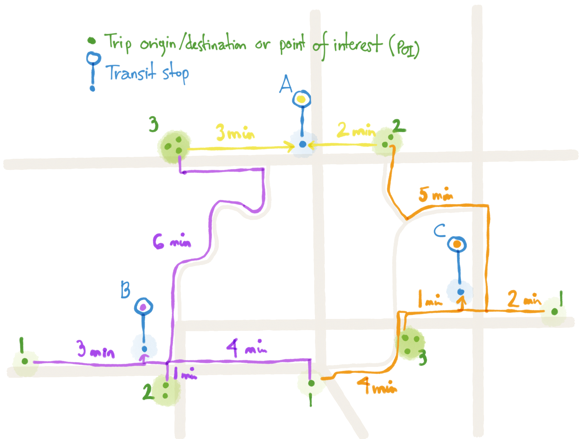

# Intrinsic and Accessibility Weights: Weighting POIs, Homes, Destinations, and Transit Nodes Attractiveness

**Weighting in transport modeling** assigns relative values to destinations, points of interest (POIs), homes, and transit nodes/facilities based on their capacity to generate or attract trips and their position in the network.

Two distinct concepts are essential to distinguish:

1.  **Intrinsic Weight** ($W_j$): The property of the location itself—what it generates or contains (employees, residents, measured ridership, floor area, etc.).
2.  **Accessibility Weight** ($A_i$): A measure derived from the environment—what a location can "reach" or "capture" based on its location relative to intrinsic weights, calculated via a gravity model.

A downtown skyscraper with 5,000 jobs (high **intrinsic weight**) carries far more potential than a suburban office with few employees. However, the **accessibility weight** of a place (e.g. a transit stop, a home, or a POI) depends on how many of these high-intrinsic-weight locations are within reach.

This distinction forms the mathematical foundation of spatial interaction models predicting how travel demand distributes across networks.

These models matter profoundly for transportation planning, especially transit planning. For example, a bus stop surrounded by 10,000 residents within 400 meters has fundamentally different ridership potential than an isolated stop serving 500 people. Gravity-based **accessibility weights** quantify this by summing opportunities weighted by distance ($\sum W_{intrinsic,j} / \text{distance}^\beta$) within catchment areas. Distance can always be replaced by walking/cycling/transit or driving travel time for more accurate modeling in congested or multi-modal contexts.

## Foundational concepts in gravity modeling

Hansen's seminal 1959 work established accessibility as "potential for opportunities for interaction", introducing the gravity-based formulation: $A_i = \sum_j (W_j \times f(d_{ij}))$.

In our terminology:
*   $A_i$ is the **Accessibility Weight** of location $i$
*   $W_j$ is the **Intrinsic Weight** of destination $j$
*   $f(d_{ij})$ is the decay function based on distance or time

The **gravity model** for trip distribution writes $T_{ij} = k \times (P_i^\lambda \times P_j^\alpha) / d_{ij}^\beta$, where $T_{ij}$ represents trips from origin $i$ to destination $j$, $P_i$ and $P_j$ are respective populations or **intrinsic weights**, $d_{ij}$ is separation distance (or travel time), and $\beta$ is the critical distance-decay parameter. Wilson's doubly-constrained gravity model (1967) ensures trip origins and destinations sum to known totals, making it the workhorse of four-step travel demand models worldwide.

### Distance and travel time decay functions

The choice between distance-based and time-based impedance functions depends on the modeling context. Travel time is generally preferred for urban areas with congestion, multi-modal analysis, and transit planning, while distance works well for rural areas or simple pedestrian catchments. In Transition, the routing engines based on OpenStreetMap data should be able to calculate travel times for walking, cycling and driving for the whole network area.

The following table includes usual functions for calculating the distance or travel time decay used in the weighting formulas.

| Function Type | Distance Formula | Time Formula | Parameters | Reference | Notes |
|--------------|------------------|--------------|------------|-----------|--------|
| **Power** | $f(d) = d^{-\beta}$ | $f(t) = t^{-\beta}$ | $\beta=1$ (inverse) $\beta=2$ (inverse squared) | Hansen (1959) Wilson (1967) | Simple, widely used |
| **Exponential** | $f(d) = \exp(-\beta \times d)$ | $f(t) = \exp(-\beta \times t)$ | $\beta$ varies by mode/purpose | Fotheringham & O'Kelly (1989) | More realistic decay |
| **Gamma** | $f(d) = a \times d^{-b} \times \exp(-c \times d)$ | $f(t) = a \times t^{-b} \times \exp(-c \times t)$ | $a, b, c > 0$ | NCHRP 716 (2012) | **Recommended standard** for four-step models |
| **Combined** | $f(d) = d^{-\beta_1} \times \exp(-\beta_2 \times d)$ | $f(t) = t^{-\beta_1} \times \exp(-\beta_2 \times t)$ | $\beta_1, \beta_2$ mode-specific | Vale & Pereira (2017) | Captures both sensitivities |
| **Logistic** | $f(d) = 1/(1+\exp(\beta \times (d-d_0)))$ | $f(t) = 1/(1+\exp(\beta \times (t-t_0)))$ | $\beta$ (steepness), $d_0/t_0$ (inflection) | Geurs & van Wee (2004) | S-shaped decay |

### Combined Decay Function Explanation

The combined function $f(t) = t^{-\beta_1} \times \exp(-\beta_2 \times t)$ merges power-law and exponential decays to better model real-world behavior. Here:

- $\beta_1$ controls the power-law component, which dominates for short times/distances, capturing local sensitivity where small changes in time have large impacts on accessibility (e.g., pedestrian aversion to even minor detours).
- $\beta_2$ governs the exponential decay, which becomes more influential for longer times/distances, representing regional sensitivity where accessibility drops off more gradually beyond a certain threshold.

This dual nature allows the function to model both immediate, sharp decay for nearby opportunities and smoother decay for distant ones, as validated in pedestrian accessibility studies (Vale & Pereira, 2017). Values are mode-specific; for walking, typical ranges are $\beta_1 = 0.5-1.5$ and $\beta_2 = 0.1-0.3$.

### Gamma function (NCHRP 716 recommended standard)

The **gamma function** is recommended by NCHRP Reports 365 and 716 as the standard for travel time-based gravity models in four-step transportation planning:

**Formula:**

$$f(t_{ij}) = a \times t_{ij}^{-b} \times \exp(-c \times t_{ij})$$

**Where:**
- $t_{ij}$ = travel time (minutes) from zone $i$ to zone $j$
- $a$ = scaling parameter ($> 0$)
- $b$ = power parameter ($> 0$)
- $c$ = exponential decay parameter ($> 0$)

**Typical coefficient ranges by trip purpose (Medium MPO):**

| Trip Purpose | a | b | c | Application |
|--------------|---|---|---|-------------|
| Home-Based Work | 2000-6000 | 0.8-1.2 | 0.05-0.10 | Work commute trips |
| Home-Based Non-Work | 1500-3500 | 0.5-0.9 | 0.08-0.15 | Shopping, social, personal |
| Non-Home-Based | 1000-2500 | 0.4-0.8 | 0.10-0.18 | Chained trips |

**Example calculation:** For home-based work trips with $t=15$ minutes using parameters $a=5280$, $b=0.926$, $c=0.087$:

$$\begin{align*}
f(15) &= 5280 \times 15^{-0.926} \times \exp(-0.087 \times 15) \\
      &= 5280 \times 0.0748 \times 0.267 \\
      &= 105.4 \text{ (friction factor)}
\end{align*}$$

## Distance and time decay parameters across modes and purposes

Empirical studies show $\beta$ values vary dramatically by mode and trip purpose, quantifying that pedestrians are extremely distance-sensitive while drivers tolerate longer trips.

### Distance-based parameters

| Mode/Purpose | Distance Decay ($\beta$) | Function Type | Data Source |
|--------------|-------------------|---------------|-------------|
| **Walking** |
| - Work | 1.683 | Power | Iacono et al. (2008) |
| - Shopping | 2.106 | Power | Iacono et al. (2008) |
| - Entertainment | 0.769 | Power | Iacono et al. (2008) |
| - To Transit (network) | 0.00217 | Exponential | Bartzokas-Tsiompras (2019) |
| **Transit** |
| - Local Bus | 0.186 | Power | Iacono et al. (2008) |
| - Light Rail | 0.046 | Power | Iacono et al. (2008) |
| - Express Bus | 0.060 | Power | Iacono et al. (2008) |
| **Auto** |
| - Work | 0.09 | Power | Iacono et al. (2008) |
| - Shopping | 0.118 | Power | Iacono et al. (2008) |

### Travel time-based parameters

| Mode/Purpose | Target Range | Primary Supporting Sources |
|--------------|--------------|---------------------------|
| **Walking mode** | $\beta$ = 0.20-0.30 (time-based) | Iacono et al. 2008 (1.68-2.11 distance converts to 0.20-0.30 time); Vale & Pereira 2017 (0.18-0.22 commute, 0.25-0.35 retail); Yang & Diez-Roux 2012 (0.09-0.10 general); Owen & Levinson 2015 (0.20-0.30) |
| **Transit** | $\beta$ = 0.08-0.12 (time-based) | Iacono et al. 2008 (0.09-0.19 with local bus 0.186); Santana Palacios & El-Geneidy 2022 (0.012-0.015); Owen & Levinson 2015 (0.08-0.12); Boisjoly & El-Geneidy 2016 (0.08-0.12) |
| **Auto/driving** | $\beta$ = 0.03-0.06 (time-based) | Iacono et al. 2008 (0.08-0.14 distance converts to 0.03-0.06 time); Levinson & Kumar 1994 (0.04-0.06); El-Geneidy & Levinson 2006 (0.10 employment) |
| **Employment accessibility** | $\beta$ = 0.08-0.12 | Owen & Levinson 2015 (0.08-0.12 transit); Boisjoly & El-Geneidy 2016 (0.08-0.12); Cheng & Bertolini 2013 (0.08-0.15); Levinson & Kumar 1994 (0.08-0.12 transit) |
| **Retail accessibility** | $\beta$ = 0.15-0.20 | Iacono et al. 2008 (shopping trips); Vale & Pereira 2017 (0.25-0.35 pedestrian retail indicating higher range appropriate) |
| **Healthcare accessibility** | $\beta$ = 0.10-0.15 | Iacono et al. 2008 (0.10); Luo & Wang 2003 (0.10 primary care); Delamater et al. 2013 (0.10-0.15 by service type); Shi et al. 2012 (0.12-0.15 cancer centers); Apparicio et al. 2008 (0.10-0.15) |

### When to use travel time vs. distance

**Use travel time when:**
1. Multi-modal analysis (transit vs. auto have different time-distance relationships)
2. Congested urban networks (speed varies significantly)
3. Accessibility to jobs/services (time is better proxy for opportunity cost)
4. Transit catchment areas with varied walking speeds
5. Four-step travel demand modeling (NCHRP 716 standard)

Transition uses travel time output from the integrated routing engines for walking, cycling, transit and driving, but can also use network distance or Euclidean/bird's-eye distance when routing engines are not available or when testing.

**Typical conversion factors:**

| Mode | Speed | Example Conversion | Reference |
|------|-------|-------------------|-----------|
| Walking | ~5 km/h (1.4 m/s; 3 mph) | 400m = 5 minutes | Bohannon (1997); Knoblauch et al. (1996); UK Design Manual for Roads and Bridges |
| Cycling | 11-18 km/h, average ~15 km/h (9 mph) | 2 km = 8 minutes | Schepers et al. (2017); City of Copenhagen Bicycle Account |
| Transit bus | 10-25 km/h | Variable with stops and congestion | Vuchic (2005); TCRP Manual; ITDP (2017) |
| Driving (urban) | 10-50 km/h | Highly variable with congestion | NACTO (2013); Li & Chen (2014) |

**Generalized cost impedance:**

$$\text{Impedance} = \alpha \times \text{time} + \beta \times \text{monetary cost} + \gamma \times \text{transfers}$$

Where time components can be weighted differently for each segment of the trip (access/egress walking, waiting, in-vehicle, walking during transfer, etc.)

Cost impedance will be covered in detail in a distinct documentation associated with explaining cost functions.

## Transit stop catchment areas and walking thresholds

Standard planning practice specifies catchment areas based on typical walking times, though empirical studies show 25-33% of pedestrian trips exceed the 400-meter threshold.

### Catchment area standards and adjustments

| Facility Type | Base Radius | Walking Time | Network Adjustment | Topography Adjustment | Effective Radius (hilly) | Reference |
|---------------|-------------|--------------|-------------------|----------------------|------------------------|-----------|
| Bus stop | 400 m | 5 min | 0.7× | 0.9× additional | ~250 m | Andersen & Landex (2008); Guerra et al. (2012) |
| Rail station | 800 m | 10 min | 0.7× | 0.9× additional | ~500 m | Guerra et al. (2012); Sung et al. (2014) |
| Light rail | 600 m | 7.5 min | 0.7× | 0.9× additional | ~380 m | ITDP (2017); Deng & Nelson (2011) |
| BRT station | 600 m | 7.5 min | 0.7× | 0.9× additional | ~380 m | ITDP (2017); Deng & Nelson (2011) |

**Calculation approaches:**
- **Circular (Euclidean)**: Simple but overestimates by 20-40%
- **Network distance**: Uses actual pedestrian paths, more accurate
- **Energy-based**: Accounts for topography—30m elevation gain adds 20% time, 35% energy (Bartzokas-Tsiompras & Photis, 2019)
- **Travel time-based**: Most accurate for multi-modal and congested contexts

**The "0.7R rule"** (Andersen & Landex, 2008): When detailed network data unavailable, use 70% of intended radius to approximate network-based catchments. For hilly terrain, reduce another 10%. Example: 800m rail station catchment becomes $800 \times 0.7 \times 0.9 = 504\text{m}$ effective radius.

Note: Catchment analysis is not yet implemented in Transition

## Intrinsic Weight methodologies by activity type

Points of Interest require differential **intrinsic weighting** reflecting their trip generation/attraction capacity:

| Intrinsic Weight Type | Methodology | Typical Values/Conversions | Data Source | Application |
|-------------|-------------|---------------------------|-------------|-------------|
| **Employment** | Weight = Jobs | Sector-specific refinement | LEHD LODES | Work travel modeling (gold standard) |
| **Floor area** | $\text{Weight} = \text{Area} \times \text{Trip rate}$ | Retail: 35-45 trips/1000ft² Office: 10-15 trips/1000ft² Residential: 8-10 trips/unit | ITE Trip Generation Manual | When employment unavailable |
| **Population** | Weight = Population | Age-specific (e.g., elderly for healthcare) | Census blocks | Residential origins, healthcare demand |
| **Visit frequency** | Weight = Check-ins/month | Direct measurement | Foursquare/LBSN | Discretionary trips, retail |
| **Mixed-use composite** | $\text{Weight} = \sum (\text{coefficient}_ i \times \text{Component}_ i)$ | Calibrated to trip generation rates | Combined sources | Multi-use developments |

### ITE Trip Generation Manual rates

The Institute of Transportation Engineers Trip Generation Manual provides empirically-derived trip rates by land use:

**Common rates (Weekday, ITE 11th Edition):**

| ITE Code | Land Use | Unit | Daily Trips | AM Peak | PM Peak |
|----------|----------|------|-------------|---------|---------|
| 710 | General Office Building | 1,000 SF | 11.0 | 1.56 | 1.49 |
| 820 | Shopping Center | 1,000 SF | 42.9 | 1.55 | 3.71 |
| 221 | Multifamily Housing (Mid-Rise) | Dwelling Unit | 5.9 | 0.38 | 0.51 |
| 720 | Medical-Dental Office | 1,000 SF | 36.1 | 4.95 | 4.21 |

**Context adjustments:**
- Dense Multi-Use Urban: Apply 13-34% reduction
- General Urban/Suburban: Use standard rates
- Internal capture for mixed-use: Use NCHRP Report 684 methodology
- Using OD trips from travel surveys are very useful to adjust and calibrate trip generation rates by type of POI or home, but more research is needed to get meaningful results.

### Aggregation Example: Shopping Mall

When assigning intrinsic weights to complex venues like a shopping mall, two approaches are possible:
1.  **Disaggregated**: Treat each shop as a distinct POI with its own intrinsic weight (e.g., specific floor area or employment), mapping each to its specific entrance inside the mall.
2.  **Aggregated**: Sum the intrinsic weights of all individual shops to get a single, cumulative intrinsic weight to the mall as a whole and assign it to the main entrance.

## Gravity-based accessibility weight formulas

**Accessibility weight** is a measure that can be calculated for any location (Home, POI, Transit Node). When applied to transit stops, it often combines service quality with surrounding land use through gravity-weighted accessibility measures.

### Basic formulas

| Measure | Formula | Application | Reference |
|---------|---------|-------------|-----------|
| **Basic accessibility** | $A_i = \sum (\text{Intrinsic Weight}_ j / \text{distance}^\beta)$ | POI-weighted catchment for any place $i$ | Hansen (1959) |
| **Service-weighted** | $A_{\text{stop}} = \text{Frequency} \times \sum (\text{Intrinsic Weight}_ j / \text{distance}^\beta)$ | Combines service & land use for stops | Standard four-step modeling |
| **Population-weighted** | $\text{Pop weighted} = \sum (\text{Pop}_ i \times \exp(-\beta \times \text{distance}_ i))$ | Trip generation potential | Bartzokas-Tsiompras (2019) |
| **Employment accessibility** | $\text{Jobs access} = \sum (\text{Jobs}_ j \times \exp(-\beta \times \text{transit time}_ {ij}))$ | Job access equity metric | Geurs & van Wee (2004) |
| **Combined index** | $I_{\text{stop}} = \sum w_i \times \text{Component}_ i$ | Multi-factor integration | Calibrated via regression |

**Combined index components:** frequency, population-weighted, employment-weighted, retail-weighted, network centrality

### Travel time-based accessibility

**Hansen accessibility weight with travel time:**

$$A_i = \sum_j (O_j \times \exp(-\beta \times t_{ij}))$$

**Where:**
- $A_i$ = **accessibility weight** / index for location $i$ (e.g. a home, a POI or a transit stop)
- $O_j$ = **intrinsic weight** / opportunities at destination $j$ (jobs, services, POIs). Could also include homes. Each of the opportunities can be weighted for its own attractivity as explained previously (would become $W_j$).
- $t_{ij}$ = travel time from $i$ to $j$ (minutes)
- $\beta$ = time decay parameter (0.08-0.12 for employment)

**Service-frequency-weighted with walking time:**

$$A_{\text{stop}} = f_{\text{stop}} \times \sum_j (W_j \times \exp(-\beta_{\text{walk}} \times t_{\text{walk},ij}))$$

**Where:**
- $f_{\text{stop}}$ = service frequency (departures/hour)
- $W_j$ = **intrinsic weight** of POI/destination $j$
- $t_{\text{walk},ij}$ = walking time from stop to POI $j$ (minutes)
- $\beta_{\text{walk}}$ = walking time decay parameter (typically 0.20-0.30)

**Combined transit + walking time impedance:**

$$A_{i,\text{transit}} = \sum_{\text{stops}} \sum_{\text{jobs}} (\text{Jobs}_ j \times \exp(-\beta_{\text{walk}} \times t_{\text{walk}} - \beta_{\text{wait}} \times t_{\text{wait}} - \beta_{\text{IVT}} \times t_{\text{IVT}}))$$

**Example calculation:** Transit stop job accessibility (accessibility weight) with 6 departures/hour:

$$A_{\text{stop}} = 6 \times \sum(\text{Jobs}_ j \times \exp(-0.25 \times \text{walking time in minutes}_ j))$$

For jobs within 10-minute walk:
- 1000 jobs (**intrinsic**) at 3 min walk: $1000 \times \exp(-0.75) = 472$ effective jobs
- 2000 jobs (**intrinsic**) at 7 min walk: $2000 \times \exp(-1.75) = 347$ effective jobs
- Total **accessibility weight**: $6 \times (472 + 347) = 4914$ job-departures/hour

### Example illustration

This image illustrates a simple pedestrian network connecting points of interest (POIs) to nearby transit nodes, with walking times labeled in minutes. It demonstrates how walking accessibility contributes to stop attractiveness calculations.

### Legend:
- **Green dots**: Trip origins/destinations or points of interest (POIs), the more dots there are, the more the weight of the POI aggregation
- **Blue dots (A,B,C)**: Transit nodes
- **Yellow, purple and orange lines**: Walking paths from POIs to nodes A, B and C respectively with access/egress walking travel time in minutes

For instance, if we set a maximum access/egress walking time of 6 min, we can see that some stops can be reached by more than one set of POIs/green dots. This overlap is normal because each POI has a choice of accessible nodes nearby, allowing for multiple paths and node options in accessibility calculations.

### Example Accessibility Weight Calculation

Using a simple gravity model with impedance function $f(t) = 1 / t^2$ (power of 2), assuming each POI (green dots) has an **intrinsic weight** of 1:

| Transit Node | Connected POIs with access time | Accessibility Weight calculation $\sum(1/t^2)$ | Total Accessibility Weight |
|--------------|-------------------------------|---------------------------|--------------|
| A | 3 POIs at 3 min, 2 POIs at 2 min | $3 / 3^2 + 2 / 2^2$ | 0.833 |
| B | 1 POI at 3 min, 2 POIs at 1 min, 1 POI at 4 min, 3 POIs at 6 min| $1 / 3^2 + 2 / 1^2 + 1 / 4^2 + 3 / 6^2$ | 2.257 |
| C | 1 POI at 4 min, 3 POIs at 1 min, 1 POI at 2 min, 2 POIs at 5 min | $1 / 4^2 + 3 / 1^2 + 1 / 2^2 + 2 / 5^2$ | 3.393 |

## Integration with travel survey destination data

Travel surveys provide observed destination choice patterns that validate and calibrate theoretical accessibility models. Survey respondents' actual destinations reveal how people make spatial choices.

**Key considerations:**
- **Survey weights application**: Use trip weights for total trips estimation: $\text{Trips annual} = \sum(\text{trip weight}_ i \times \text{trips}_ i)$; use person weights for destination choice probabilities. Note that survey weights are distinct from intrinsic/accessibility weights.
- **Destination choice modeling**: Multinomial logit where **intrinsic weight** (employment, floor area, composite) appears in utility function: $P_{ij} = \exp(V_{ij}) / \sum_k \exp(V_{ik})$ where $V_{ij} = \alpha \times \ln(\text{Intrinsic Weight}_ j) - \beta \times \text{TravelCost}_ {ij} + \gamma \times \text{Attributes}_ j$
- **Model validation**: Compare predicted vs. observed trip distributions (target $R^2 > 0.85$); match trip length distributions

For a summarized survey weighting description, see [companion document on travel survey weighting](travelSurveyWeighting.md).

## Accessibility measures for performance evaluation

Four main accessibility measure types serve distinct analytical purposes:

| Measure Type | Formula | Advantages | Limitations | Best Use |
|-------------|---------|------------|-------------|----------|
| **Cumulative opportunities** | $A_i = \sum_{j: t_{ij} \leq T} \text{Opportunities}_ j$ | Simple to calculate and communicate | Binary cutoff ignores marginal differences | Public communication |
| **Gravity-based** | $A_i = \sum_j \text{Opportunities}_ j \times \exp(-\beta \times \text{cost}_ {ij})$ | Continuous decay, accounts for all destinations | Requires $\beta$ calibration | Technical analysis, planning studies |
| **Utility-based (logsum)** | $A_i = \ln(\sum_j \exp(V_{ij}))$ | Theoretically elegant, welfare-consistent | Requires complete destination choice model | Detailed policy evaluation |
| **Space-time prism** | Accounts for temporal constraints | Realistic for individual schedules | Computationally intensive, data-demanding | Specialized studies |

**Selection guidance**: Most transit planning uses gravity measures for technical work while reporting cumulative measures for public communication. Presenting heat maps with weighted data can help illustrate attractivity and accessibility for a specific region or network.

## Node-place model for station hierarchy

Bertolini's node-place model (1999) provides an elegant framework for evaluating transit station potential. Stations plot on two-dimensional space: node value (transport function) versus place value (land use function).

**Node value** measures transport accessibility through: number of transport lines, service frequency, travel time to employment centers, network centrality, and vehicle capacity.

**Place value** quantifies surrounding land use: population density, employment density, land use diversity (entropy index), building density (FAR), and activity mix.

**The node-place matrix** identifies five station types:
- **Balanced nodes** (high node, high place): Ideal transit-oriented development
- **Dependent nodes** (low node, high place): Dense urban areas with inadequate transit
- **Unsupported nodes** (high node, low place): Transit investment on low-density areas—redevelopment opportunities
- **Stress nodes** (moderate both): Require focused improvements
- **Unbalanced nodes**: Either node or place needs enhancement

## Summary: Distance vs. time in practice

**Example comparison:** Same origin-destination pair
- Distance: 5 km
- Travel time: 15 minutes (auto in congestion)
- Walking time: 60 minutes (at 5 km/h)

**Results:**
- Distance-based: $f(d) = \exp(-0.10 \times 5) = 0.607$
- Time-based (auto): $f(t) = \exp(-0.08 \times 15) = 0.301$
- Time-based (walk): $f(t) = \exp(-0.25 \times 60) = 3.06 \times 10^{-7}$

**Conclusion:** Time-based functions better capture mode-specific accessibility differences, especially in multi-modal and congested contexts.

## Key references

**Foundational Gravity Models:**
- Hansen, W. G. (1959). How Accessibility Shapes Land Use. Journal of the American Institute of Planners, 25(2), 73-76.
- Wilson, A. G. (1967). A Statistical Theory of Spatial Distribution Models. Transportation Research, 1(3), 253-269.
- Fotheringham, A. S., & O'Kelly, M. E. (1989). Spatial Interaction Models: Formulations and Applications. Kluwer Academic Publishers.

**Travel Demand Forecasting Standards:**
- [Cambridge Systematics, Inc. (2012). NCHRP Report 716: Travel Demand Forecasting: Parameters and Techniques. Transportation Research Board.](https://nap.nationalacademies.org/read/14665/)
- Levinson, D., & Kumar, A. (1994). Multimodal Trip Distribution: Structure and Application. Transportation Research Record, 1466, 124-131.

**Distance Decay Parameters:**
- [Iacono, M., Krizek, K., & El-Geneidy, A. (2008). Access to Destinations: How Close is Close Enough? Minnesota DOT Report 2008-11.](https://www.lrrb.org/pdf/200811.pdf)
- Bartzokas-Tsiompras, A., & Photis, Y. N. (2019). Measuring Rapid Transit Accessibility and Equity in Migrant Communities Across 17 European Cities. International Journal of Transport Development and Integration, 3(3), 245-258. DOI: 10.2495/TDI-V3-N3-245-258
- Vale, D. S., & Pereira, M. (2017). The Influence of the Impedance Function on Gravity-based Pedestrian Accessibility Measures. Environment and Planning B, 44(4), 740-763.
- Yang, Y., & Diez-Roux, A. V. (2012). Walking Distance by Trip Purpose and Population Subgroups. American Journal of Preventive Medicine, 43(1), 11-19. DOI: 10.1016/j.amepre.2012.03.015
- Owen, A., & Levinson, D. M. (2015). Modeling the Commute Mode Share of Transit Using Continuous Accessibility to Jobs. Transportation Research Part A, 74, 110-122. DOI: 10.1016/j.tra.2015.02.002
- Santana Palacios, M., & El-Geneidy, A. (2022). Cumulative versus Gravity-based Accessibility Measures: Which One to Use? Findings, February 2022. DOI: 10.32866/001c.32444

**Transit Catchment Areas:**
- Andersen, J. L. E., & Landex, A. (2008). Catchment Areas for Public Transport. WIT Transactions on The Built Environment, 101, 175-184.
- Guerra, E., Cervero, R., & Tischler, D. (2012). Half-Mile Circle: Does It Best Represent Transit Station Catchment Areas? Transportation Research Record, 2276(1), 101-109. DOI: 10.3141/2276-12
- Deng, T., & Nelson, J. D. (2011). Recent Developments in Bus Rapid Transit: A Review of the Literature. Transport Reviews, 31(1), 69-96.
- Sung, H., Choi, K., Lee, S., & Cheon, S. (2014). Exploring the Impacts of Land Use by Service Coverage and Station-Level Ridership on Light Rail Transit Ridership. Journal of Transport Geography, 36, 134-140.
- [ITDP (2017). BRT Planning Guide, 4th Edition. Institute for Transportation & Development Policy.](https://brtguide.itdp.org/)
- Currie, G. (2010). Quantifying Spatial Gaps in Public Transport Supply Based on Social Needs. Journal of Transport Geography, 18(1), 31-41.

**Accessibility Measures:**
- Geurs, K. T., & van Wee, B. (2004). Accessibility Evaluation of Land-use and Transport Strategies: Review and Research Directions. Journal of Transport Geography, 12(2), 127-140.
- El-Geneidy, A., & Levinson, D. (2006). Access to Destinations: Development of Accessibility Measures. Minnesota Department of Transportation Report 2006-16.
- Bhat, C., Handy, S., Kockelman, K., et al. (2000). Development of an Urban Accessibility Index: Literature Review. Texas DOT Report 7-4938-1.
- Boisjoly, G., & El-Geneidy, A. M. (2016). Daily Fluctuations in Transit and Job Availability: A Comparative Assessment of Time-Sensitive Accessibility Measures. Journal of Transport Geography, 52, 73-81. DOI: 10.1016/j.jtrangeo.2016.03.004
- Cheng, J., & Bertolini, L. (2013). Measuring Urban Job Accessibility with Distance Decay, Competition and Diversity. Journal of Transport Geography, 30, 100-109. DOI: 10.1016/j.jtrangeo.2013.03.005

**Healthcare Accessibility:**
- Luo, W., & Wang, F. (2003). Measures of Spatial Accessibility to Health Care in a GIS Environment: Synthesis and a Case Study in the Chicago Region. Environment and Planning B: Planning and Design, 30(6), 865-884. DOI: 10.1068/b29120
- Delamater, P. L., Messina, J. P., Shortridge, A. M., & Grady, S. C. (2013). Measuring Geographic Access to Health Care: Raster and Network-Based Methods. BMC Health Services Research, 13, 35. DOI: 10.1186/1472-6963-13-35
- Shi, X., Alford-Teaster, J., Onega, T., & Wang, D. (2012). Spatial Access and Local Demand for Major Cancer Care Facilities in the United States. Annals of the Association of American Geographers, 102(5), 1125-1134. DOI: 10.1080/00045608.2012.657498
- Apparicio, P., Abdelmajid, M., Riva, M., & Shearmur, R. (2008). Comparing Alternative Approaches to Measuring the Geographical Accessibility of Urban Health Services: Distance Types and Aggregation-Error Issues. International Journal of Health Geographics, 7, 7. DOI: 10.1186/1476-072X-7-7

**Modal Speeds:**
- Bohannon, R. W. (1997). Comfortable and Maximum Walking Speed of Adults Aged 20-79 Years: Reference Values and Determinants. Age and Ageing, 26(1), 15-19. DOI: 10.1093/ageing/26.1.15
- Knoblauch, R. L., Pietrucha, M. T., & Nitzburg, M. (1996). Field Studies of Pedestrian Walking Speed and Start-Up Time. Transportation Research Record, 1538, 27-38. DOI: 10.3141/1538-04
- Christopoulou, P. Z., & Politis, I. (2024). Pedestrian Walking Speed Analysis: A Systematic Review. Sustainability, 16(11), 4813. DOI: 10.3390/su16114813
- Forde, A., & Daniel, J. (2020). Pedestrian Walking Speed at Un-signalized Midblock Crosswalk and Its Impact on Urban Street Segment Performance. Journal of Traffic and Transportation Engineering (English Edition), 7(6), 850-863. DOI: 10.1016/j.jtte.2018.10.015
- City of Copenhagen. Copenhagen Bicycle Account (annual reports). Copenhagen: Technical and Environmental Administration.
- Schepers, P., Hagenzieker, M., Methorst, R., van Wee, B., & Wegman, F. (2017). An Analysis of Cyclists' Speed at Combined Pedestrian and Cycle Paths. Traffic Injury Prevention, 18(suppl 1), S77-S82. DOI: 10.1080/15389588.2017.1347212
- Schliebe, T., & Bossert, A. (2025). Cycling Speeds in Urban Traffic. Findings, January 2025. DOI: 10.32866/001c.141204
- Vuchic, V. R. (2005). Urban Transit: Operations, Planning, and Economics. John Wiley & Sons, Hoboken, NJ.
- Transit Capacity and Quality of Service Manual (TCRP Report 165). (2013). Transit Cooperative Research Program, Transportation Research Board, Washington, DC.
- Jain, G. V., Jain, S. S., & Parida, M. (2022). Evaluation of Travel Speed of Conventional Buses and Bus Rapid Transit Service in Ahmedabad City, India Using Geo-informatics. Case Studies on Transport Policy, 10(2), 1088-1102. DOI: 10.1016/j.cstp.2022.03.014
- Li, J., & Chen, X. (2014). Sustainability Assessment of Speed Regulation of Urban Traffic. Procedia - Social and Behavioral Sciences, 96, 2374-2383. DOI: 10.1016/j.sbspro.2013.08.268
- NACTO (National Association of City Transportation Officials). (2013). Urban Street Design Guide. Island Press, Washington, DC.
- UK Department for Transport. Design Manual for Roads and Bridges. UK Highways Agency Standards.
- Transport for London. Public Transport Accessibility Level (PTAL) Methodology. London: Transport for London.

**Node-Place Model:**
- Bertolini, L. (1999). Spatial Development Patterns and Public Transport: The Application of an Analytical Model in the Netherlands. Planning Practice and Research, 14(2), 199-210.

**Trip Generation:**
- Institute of Transportation Engineers (2021). Trip Generation Manual, 11th Edition. ITE, Washington, DC.
- ITE (2017). Trip Generation Handbook, 3rd Edition. ITE, Washington, DC.
- Bochner, B. S., et al. (2011). NCHRP Report 684: Enhancing Internal Trip Capture Estimation for Mixed-Use Developments. Transportation Research Board.

**Recent Applications:**
- Hadjidimitriou, N. S., et al. (2025). Hansen's Accessibility Theory and Machine Learning: a Potential Merger. Networks and Spatial Economics. DOI: 10.1007/s11067-025-09674-2
- Zhou, Y., et al. (2025). Node Importance Calculation in Bus-Metro Composite Network Considering Land Use. Tunnelling and Underground Space Technology, 163, 106723.
