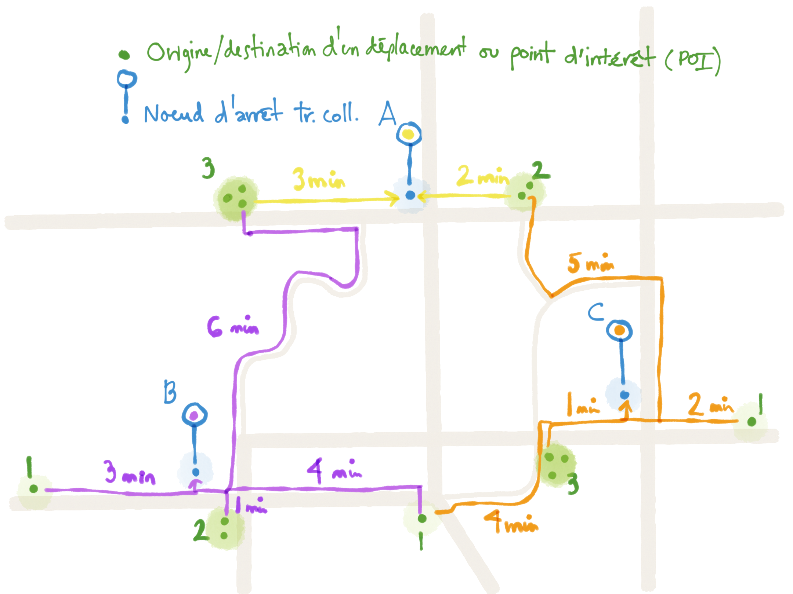

# Pondération des points d'intérêt, domiciles, destinations et attractivité des nœuds de transport collectif

**La pondération en modélisation des transports** attribue des valeurs relatives aux destinations, points d'intérêt (POI), domiciles et nœuds/stations de transport collectif en fonction de leur capacité à générer ou attirer des déplacements.

Deux concepts distincts sont essentiels à distinguer :

1.  **Poids propre** (*Intrinsic Weight*, $W_j$) : La propriété intrinsèque du lieu lui-même — ce qu'il génère ou contient (employés, résidents, achalandage mesuré, surface de plancher, etc.).
2.  **Poids d'accessibilité** (*Accessibility Weight*, $A_i$) : Une mesure dérivée de l'environnement — ce que le lieu peut "capter" ou "atteindre" selon sa localisation par rapport aux poids propres, calculée via un modèle gravitaire.

Un édifice du centre-ville avec 5000 emplois (haut **poids propre**) a un potentiel bien plus important qu'un bureau de banlieue. Cependant, le **poids d'accessibilité** d'un lieu (ex: un arrêt de transport, un domicile ou un POI) dépend de combien de ces lieux à haut poids propre sont à sa portée.

Cette distinction constitue le fondement mathématique des modèles d'interaction spatiale qui prédisent comment la demande de déplacement se distribue sur les réseaux.

Ces modèles sont d'une importance capitale pour la planification du transport, en particulier la planification du transport collectif. Par exemple, un arrêt de bus entouré de 10 000 résidents dans un rayon de 400 mètres a un potentiel d'achalandage fondamentalement différent d'un arrêt isolé desservant 500 personnes. Les **poids d'accessibilité** basés sur la gravité quantifient cela en additionnant les opportunités pondérées ($\sum W_{propre,j} / \text{distance}^\beta$) dans les zones de desserte. La distance peut être remplacée par le temps de déplacement à pied/à vélo/en transport collectif ou en voiture pour une modélisation plus précise dans des contextes de congestion ou multimodaux.

## Concepts fondamentaux de la modélisation gravitaire

Les travaux de Hansen en 1959 ont établi l'accessibilité comme un "potentiel d'opportunités d'interaction", introduisant la formulation basée sur la gravité: $A_i = \sum_j (W_j \times f(d_{ij}))$.

Dans notre terminologie :
*   $A_i$ est le **Poids d'accessibilité** du lieu $i$
*   $W_j$ est le **Poids propre** de la destination $j$
*   $f(d_{ij})$ est la fonction de décroissance selon la distance ou le temps

Le **modèle gravitaire** pour la distribution des déplacements s'écrit $T_{ij} = k \times (P_i^\lambda \times P_j^\alpha) / d_{ij}^\beta$, où $T_{ij}$ représente les déplacements de l'origine $i$ vers la destination $j$, $P_i$ et $P_j$ sont les populations respectives ou les **poids propres** (mesures d'attractivité), $d_{ij}$ est la distance de séparation (ou le temps de déplacement), et $\beta$ est le paramètre critique de décroissance en fonction de la distance. Le modèle gravitaire doublement contraint de Wilson (1967) assure que les origines et destinations des déplacements totalisent des valeurs connues, ce qui en fait le pilier des modèles de demande de transport en quatre étapes dans le monde entier.

### Fonctions de décroissance en fonction de la distance et du temps de déplacement

Le choix entre les fonctions d'impédance basées sur la distance et celles basées sur le temps dépend du contexte de modélisation. Le temps de déplacement est généralement préféré pour les zones urbaines congestionnées, l'analyse multimodale et la planification du transport collectif, tandis que la distance fonctionne bien pour les zones rurales ou les bassins de desserte piétons simples.

Le tableau suivant inclut les manières usuelles de calculer la fonction de décroissance de distance ou de temps de parcours utilisée dans les formules de pondération.

| Type de fonction | Formule de distance | Formule de temps | Paramètres | Référence | Notes |
|------------------|---------------------|------------------|------------|-----------|-------|
| **Puissance** | $f(d) = d^{-\beta}$ | $f(t) = t^{-\beta}$ | $\beta=1$ (inverse) $\beta=2$ (inverse au carré) | Hansen (1959) Wilson (1967) | Simple, largement utilisé |
| **Exponentielle** | $f(d) = \exp(-\beta \times d)$ | $f(t) = \exp(-\beta \times t)$ | $\beta$ varie selon le mode/motif | Fotheringham & O'Kelly (1989) | Décroissance plus réaliste |
| **Gamma** | $f(d) = a \times d^{-b} \times \exp(-c \times d)$ | $f(t) = a \times t^{-b} \times \exp(-c \times t)$ | $a, b, c > 0$ | NCHRP 716 (2012) | **Norme recommandée** pour les modèles en quatre étapes |
| **Combinée** | $f(d) = d^{-\beta_1} \times \exp(-\beta_2 \times d)$ | $f(t) = t^{-\beta_1} \times \exp(-\beta_2 \times t)$ | $\beta_1, \beta_2$ spécifiques au mode | Vale & Pereira (2017) | Capture les deux sensibilités |
| **Logistique** | $f(d) = 1/(1+\exp(\beta \times (d-d_0)))$ | $f(t) = 1/(1+\exp(\beta \times (t-t_0)))$ | $\beta$ (raideur), $d_0/t_0$ (inflexion) | Geurs & van Wee (2004) | Décroissance en forme de S |

### Explication de la fonction de décroissance combinée

La fonction combinée $f(t) = t^{-\beta_1} \times \exp(-\beta_2 \times t)$ fusionne les décroissances puissance et exponentielle pour mieux modéliser le comportement réel. Ici:

- $\beta_1$ contrôle la composante puissance, qui domine pour les temps/distances courts, capturant la sensibilité locale où de petits changements de temps ont de grands impacts sur l'accessibilité (ex. aversion piétonne pour des détours mineurs).
- $\beta_2$ gouverne la décroissance exponentielle, qui devient plus influente pour les temps/distances plus longs, représentant la sensibilité régionale où l'accessibilité diminue plus progressivement au-delà d'un certain seuil.

Cette nature duale permet à la fonction de modéliser à la fois la décroissance immédiate et abrupte pour les opportunités proches et une décroissance plus douce pour les distantes, comme validé dans les études d'accessibilité piétonne (Vale & Pereira, 2017). Les valeurs sont spécifiques au mode; pour la marche, les plages typiques sont $\beta_1 = 0.5-1.5$ et $\beta_2 = 0.1-0.3$.

### Fonction gamma (norme recommandée NCHRP 716)

La **fonction gamma** est recommandée par les rapports NCHRP 365 et 716 comme norme pour les modèles gravitaires basés sur le temps de déplacement dans la planification des transports en quatre étapes:

**Formule:**

$$f(t_{ij}) = a \times t_{ij}^{-b} \times \exp(-c \times t_{ij})$$

**Où:**
- $t_{ij}$ = temps de déplacement (minutes) de la zone $i$ à la zone $j$
- $a$ = paramètre d'échelle ($> 0$)
- $b$ = paramètre de puissance ($> 0$)
- $c$ = paramètre de décroissance exponentielle ($> 0$)

**Plages typiques de coefficients par motif de déplacement (MPO moyenne):**

| Motif de déplacement | a | b | c | Application |
|----------------------|---|---|---|-------------|
| Domicile-Travail | 2000-6000 | 0.8-1.2 | 0.05-0.10 | Déplacements domicile-travail |
| Domicile-Autres | 1500-3500 | 0.5-0.9 | 0.08-0.15 | Magasinage, social, personnel |
| Non basé au domicile | 1000-2500 | 0.4-0.8 | 0.10-0.18 | Déplacements en chaîne |

**Exemple de calcul:** Pour les déplacements domicile-travail avec $t=15$ minutes en utilisant les paramètres $a=5280$, $b=0.926$, $c=0.087$:

$$\begin{align*}
f(15) &= 5280 \times 15^{-0.926} \times \exp(-0.087 \times 15) \\
      &= 5280 \times 0.0748 \times 0.267 \\
      &= 105.4 \text{ (facteur de friction)}
\end{align*}$$

## Paramètres de décroissance en fonction de la distance et du temps selon les modes et motifs

Les études empiriques montrent que les valeurs de $\beta$ varient considérablement selon le mode et le motif de déplacement, quantifiant que les piétons sont extrêmement sensibles à la distance tandis que les automobilistes tolèrent des déplacements plus longs.

### Paramètres basés sur la distance

| Mode/Motif | Décroissance en distance ($\beta$) | Type de fonction | Source de données |
|------------|------------------------------|------------------|-------------------|
| **Marche** |
| - Travail | 1.683 | Puissance | Iacono et al. (2008) |
| - Magasinage | 2.106 | Puissance | Iacono et al. (2008) |
| - Divertissement | 0.769 | Puissance | Iacono et al. (2008) |
| - Vers le transport collectif (réseau) | 0.00217 | Exponentielle | Bartzokas-Tsiompras (2019) |
| **Transport collectif** |
| - Autobus local | 0.186 | Puissance | Iacono et al. (2008) |
| - Train léger | 0.046 | Puissance | Iacono et al. (2008) |
| - Autobus express | 0.060 | Puissance | Iacono et al. (2008) |
| **Auto** |
| - Travail | 0.09 | Puissance | Iacono et al. (2008) |
| - Magasinage | 0.118 | Puissance | Iacono et al. (2008) |

### Paramètres basés sur le temps de déplacement

| Mode/Objectif | Plage cible | Principales sources de soutien |
|--------------|-------------|--------------------------------|
| **Mode marche** | $\beta$ = 0.20-0.30 (basé sur le temps) | Iacono et al. 2008 (1.68-2.11 en distance se convertit en 0.20-0.30 en temps); Vale & Pereira 2017 (0.18-0.22 navettage, 0.25-0.35 commerce); Yang & Diez-Roux 2012 (0.09-0.10 général); Owen & Levinson 2015 (0.20-0.30) |
| **Transport collectif local** | $\beta$ = 0.08-0.12 (basé sur le temps) | Iacono et al. 2008 (0.09-0.19 avec bus local 0.186); Santana Palacios & El-Geneidy 2022 (0.012-0.015); Owen & Levinson 2015 (0.08-0.12); Boisjoly & El-Geneidy 2016 (0.08-0.12) |
| **Auto/conduite** | $\beta$ = 0.03-0.06 (basé sur le temps) | Iacono et al. 2008 (0.08-0.14 en distance se convertit en 0.03-0.06 en temps); Levinson & Kumar 1994 (0.04-0.06); El-Geneidy & Levinson 2006 (0.10 emploi) |
| **Accessibilité à l'emploi** | $\beta$ = 0.08-0.12 | Owen & Levinson 2015 (0.08-0.12 transport collectif); Boisjoly & El-Geneidy 2016 (0.08-0.12); Cheng & Bertolini 2013 (0.08-0.15); Levinson & Kumar 1994 (0.08-0.12 transport collectif) |
| **Accessibilité au commerce** | $\beta$ = 0.15-0.20 | Iacono et al. 2008 (déplacements magasinage); Vale & Pereira 2017 (0.25-0.35 commerce piéton indiquant une plage plus élevée appropriée) |
| **Accessibilité aux soins de santé** | $\beta$ = 0.10-0.15 | Iacono et al. 2008 (0.10); Luo & Wang 2003 (0.10 soins primaires); Delamater et al. 2013 (0.10-0.15 par type de service); Shi et al. 2012 (0.12-0.15 centres de cancérologie); Apparicio et al. 2008 (0.10-0.15) |

### Quand utiliser le temps de déplacement vs la distance

**Utiliser le temps de déplacement quand:**
1. Analyse multimodale (le transport collectif et l'auto ont des relations temps-distance différentes)
2. Réseaux urbains congestionnés (la vitesse varie considérablement)
3. Accessibilité aux emplois/services (le temps est un meilleur proxy pour le coût d'opportunité)
4. Zones de desserte du transport collectif avec des vitesses de marche variées
5. Modélisation de la demande de transport en quatre étapes (norme NCHRP 716)

Transition utilise les résultats de temps de parcours retournés par les engins de calcul de chemin intégrés pour la marche, le vélo, le transport collectif et la voiture, mais peut également utiliser la distance réseau ou la distance euclidienne/à vol d'oiseau lorsque les engins de calcul de chemins ne sont pas disponibles ou pour compléter des tests.

**Facteurs de conversion typiques:**

| Mode | Vitesse | Exemple de conversion | Référence |
|------|---------|----------------------|-----------|
| Marche | ~5 km/h (1.4 m/s; 3 mph) | 400 m = 5 minutes | Bohannon (1997); Knoblauch et al. (1996); UK Design Manual for Roads and Bridges |
| Vélo | 11-18 km/h, moyenne ~15 km/h (9 mph) | 2 km = 8 minutes | Schepers et al. (2017); City of Copenhagen Bicycle Account |
| Bus urbain | 10-25 km/h | Variable avec les arrêts et la congestion | Vuchic (2005); TCRP Manual; ITDP (2017) |
| Auto (urbaine) | 10-50 km/h | Très variable avec la congestion | NACTO (2013); Li & Chen (2014) |

**Impédance de coût généralisé:**

$$\text{Impédance} = \alpha \times \text{temps} + \beta \times \text{coût monétaire} + \gamma \times \text{transferts}$$

Où les composantes du temps peuvent être pondérées différemment pour chaque segment du déplacement (accès, attente, en véhicule, accès lors des transfert, etc.)

L'impédance de coût généralisé sera couverte dans une documentation distincte associée à la description des fonctions de coût.

## Zones de desserte des arrêts de transport collectif et seuils de marche

La pratique de planification standard spécifie des zones de desserte basées sur des temps de marche typiques, bien que les études empiriques montrent que 25 à 33% des déplacements piétons dépassent le seuil de 400 mètres.

### Normes de zones de desserte et ajustements

| Type d'installation | Rayon de base | Temps de marche | Ajustement réseau | Ajustement topographie | Rayon effectif (vallonné) | Référence |
|---------------------|---------------|-----------------|-------------------|------------------------|---------------------------|-----------|
| Arrêt d'autobus | 400 m | 5 min | 0.7× | 0.9× additionnel | ~250 m | Andersen & Landex (2008); Guerra et al. (2012) |
| Station ferroviaire | 800 m | 10 min | 0.7× | 0.9× additionnel | ~500 m | Guerra et al. (2012); Sung et al. (2014) |
| Train léger | 600 m | 7.5 min | 0.7× | 0.9× additionnel | ~380 m | ITDP (2017); Deng & Nelson (2011) |
| Station SRB | 600 m | 7.5 min | 0.7× | 0.9× additionnel | ~380 m | ITDP (2017); Deng & Nelson (2011) |

**Approches de calcul:**
- **Circulaire (euclidienne)**: Simple mais surestime de 20 à 40%
- **Distance réseau**: Utilise les chemins piétons réels, plus précis
- **Basée sur l'énergie**: Tient compte de la topographie—un gain d'élévation de 30m ajoute 20% de temps, 35% d'énergie (Bartzokas-Tsiompras & Photis, 2019)
- **Basée sur le temps de déplacement**: Plus précis pour les contextes multimodaux et congestionnés

**La "règle du 0.7R"** (Andersen & Landex, 2008): Lorsque des données détaillées sur le réseau ne sont pas disponibles, utiliser 70% du rayon prévu pour approximer les zones de desserte basées sur le réseau. Pour un terrain vallonné, réduire de 10% supplémentaires. Exemple: une zone de desserte de station ferroviaire de 800m devient $800 \times 0.7 \times 0.9 = 504\text{m}$ de rayon effectif.

Note: Les zones de desserte/attractivité des arrêts ne sont pas encore prises en compte dans Transition.

## Méthodologies de pondération des POI (Poids propre) par type d'activité

Les points d'intérêt nécessitent une **pondération intrinsèque (poids propre)** différentielle reflétant leur capacité de génération/attraction de déplacements:

| Type de poids propre | Méthodologie | Valeurs/conversions typiques | Source de données | Application |
|---------------|--------------|------------------------------|-------------------|-------------|
| **Emploi** | Poids = Emplois | Raffinement spécifique au secteur | LEHD LODES | Modélisation des déplacements domicile-travail (étalon-or) |
| **Surface de plancher** | $\text{Poids} = \text{Surface} \times \text{Taux de déplacement}$ | Commerce: 35-45 dép./1000pi² Bureau: 10-15 dép./1000pi² Résidentiel: 8-10 dép./unité | Manuel de génération de déplacements ITE | Quand l'emploi n'est pas disponible |
| **Population** | Poids = Population | Spécifique à l'âge (ex: personnes âgées pour soins de santé) | Îlots de recensement | Origines résidentielles, demande en soins de santé |
| **Fréquence de visite** | Poids = Enregistrements/mois | Mesure directe | Foursquare/LBSN | Déplacements discrétionnaires, commerce de détail |
| **Composite à usage mixte** | $\text{Poids} = \sum (\text{coefficient}_ i \times \text{Composante}_ i)$ | Calibré aux taux de génération de déplacements | Sources combinées | Développements à usages multiples |

### Taux du manuel de génération de déplacements ITE

Le manuel de génération de déplacements de l'Institute of Transportation Engineers fournit des taux de déplacements dérivés empiriquement par usage du sol:

**Taux courants (jour de semaine, ITE 11e édition):**

| Code ITE | Usage du sol | Unité | Déplacements quotidiens | Pointe AM | Pointe PM |
|----------|--------------|-------|-------------------------|-----------|-----------|
| 710 | Immeuble de bureaux général | 1 000 pi² | 11.0 | 1.56 | 1.49 |
| 820 | Centre commercial | 1 000 pi² | 42.9 | 1.55 | 3.71 |
| 221 | Logement multifamilial (moyenne hauteur) | Unité d'habitation | 5.9 | 0.38 | 0.51 |
| 720 | Bureau médical-dentaire | 1 000 pi² | 36.1 | 4.95 | 4.21 |

**Ajustements contextuels:**
- Urbain dense à usage mixte: Appliquer une réduction de 13 à 34%
- Urbain général/banlieue: Utiliser les taux standard
- Capture interne pour usage mixte: Utiliser la méthodologie du rapport NCHRP 684
- L'utilisation de déplacements OD à partir d'enquêtes de mobilité est très utile pour ajuster et calibrer les taux de génération par type de lieu ou domicile, mais davantage de travaux de recherche sont requis pour obtenir des résultats probants.

### Exemple d'agrégation : Centre commercial

Lors de l'attribution de poids propres à des lieux complexes comme un centre commercial, deux approches sont possibles :
1.  **Désagrégée** : Traiter chaque commerce comme un POI distinct avec son propre poids propre (ex : surface de plancher ou emploi spécifique), en cartographiant chacun à son entrée spécifique dans le centre.
2.  **Agrégée** : Somme des poids propres de tous les commerces individuels pour obtenir un poids propre unique et cumulatif à l'ensemble du centre commercial, assigné ensuite à la porte principale.

## Formules de poids d'accessibilité basées sur la gravité

Le **poids d'accessibilité** est une mesure qui peut être calculée pour n'importe quel lieu (Domicile, POI, Nœud de transport). Lorsqu'appliqué aux arrêts de transport collectif, il combine souvent la qualité du service avec l'usage du sol environnant à travers des mesures d'accessibilité pondérées par gravité.

### Formules de base

| Mesure | Formule | Application | Référence |
|--------|---------|-------------|-----------|
| **Accessibilité de base** | $A_i = \sum (\text{Poids propre POI} / \text{distance}^\beta)$ | Zone de desserte pondérée pour tout lieu $i$ | Hansen (1959) |
| **Pondérée par le service** | $A_{\text{arrêt}} = \text{Fréquence} \times \sum (\text{Poids propre POI} / \text{distance}^\beta)$ | Combine le service et l'usage du sol pour les arrêts | Modélisation standard en quatre étapes |
| **Pondérée par la population** | $\text{Pop pondérée} = \sum (\text{Pop}_ i \times \exp(-\beta \times \text{distance}_ i))$ | Potentiel de génération de déplacements | Bartzokas-Tsiompras (2019) |
| **Accessibilité à l'emploi** | $\text{Accès emplois} = \sum (\text{Emplois}_ j \times \exp(-\beta \times \text{temps TC},ij))$ | Métrique d'équité d'accès aux emplois | Geurs & van Wee (2004) |
| **Indice combiné** | $I_{\text{arrêt}} = \sum w_i \times \text{Composante}_ i$ | Intégration multi-facteurs | Calibré via régression |

**Composantes de l'indice combiné:** fréquence, pondérée par la population, pondérée par l'emploi, pondérée par le commerce de détail, centralité du réseau

### Accessibilité basée sur le temps de déplacement

**Poids d'accessibilité de Hansen avec temps de déplacement:**

$$A_i = \sum_j (O_j \times \exp(-\beta \times t_{ij}))$$

**Où:**
- $A_i$ = **poids d'accessibilité** / indice d'accessibilité pour l'emplacement $i$ (ex: un domicile, un POI ou un arrêt de transport)
- $O_j$ = **poids propre** / opportunités à la destination $j$ (emplois, services, POI). Peut également inclure les domiciles. Chacune des opportunités peut être pondérée pour sa propre attractivité comme expliqué précédemment (deviendrait $W_j$).
- $t_{ij}$ = temps de déplacement de $i$ à $j$ (minutes)
- $\beta$ = paramètre de décroissance temporelle (0.08-0.12 pour l'emploi)

**Pondérée par la fréquence de service avec temps de marche:**

$$A_{\text{arrêt}} = f_{\text{arrêt}} \times \sum_j (W_j \times \exp(-\beta_{\text{marche}} \times t_{\text{marche},ij}))$$

**Où:**
- $f_{\text{arrêt}}$ = fréquence de service (départs/heure)
- $W_j$ = **poids propre** du POI/destination $j$
- $t_{\text{marche},ij}$ = temps de marche de l'arrêt au POI $j$ (minutes)
- $\beta_{\text{marche}}$ = paramètre de décroissance du temps de marche (typiquement 0.20-0.30)

**Impédance combinée transport collectif + temps de marche:**

$$A_{i,\text{TC}} = \sum_{\text{arrêts}} \sum_{\text{emplois}} (\text{Emplois}_ j \times \exp(-\beta_{\text{marche}} \times t_{\text{marche}} - \beta_{\text{attente}} \times t_{\text{attente}} - \beta_{\text{IVT}} \times t_{\text{IVT}}))$$

**Exemple de calcul:** Accessibilité aux emplois (poids d'accessibilité) d'un arrêt de transport collectif avec 6 départs/heure:

$$A_{\text{arrêt}} = 6 \times \sum(\text{Emplois}_ j \times \exp(-0.25 \times \text{temps de marche en minutes}_ j))$$

Pour les emplois dans un rayon de 10 minutes de marche:
- 1000 emplois (**poids propre**) à 3 min de marche: $1000 \times \exp(-0.75) = 472$ emplois effectifs
- 2000 emplois (**poids propre**) à 7 min de marche: $2000 \times \exp(-1.75) = 347$ emplois effectifs
- **Poids d'accessibilité** total: $6 \times (472 + 347) = 4\,914$ emplois-départs/heure

### Illustration d'exemple

Cette image illustre un réseau piéton simple reliant des points d'intérêt (POI) à des nœuds d'arrêt de transport collectif proches, avec les temps de marche indiqués en minutes. Elle démontre comment l'accessibilité piétonne contribue aux calculs d'attractivité des arrêts.

### Légende :
- **Points verts** : Origines/destinations de déplacement ou points d'intérêt (POI), plus il y a de points, plus le poids de l'agrégation de POI est important
- **Points bleus (A,B,C)** : Nœuds de transport collectif
- **Lignes jaune, mauve et orange** : Chemins de marche vers les nœuds A, B et C respectivement avec temps de parcours d'accès à pied en minutes

Si nous fixons par exemple un temps de marche d'accès maximum de 6 min, nous pouvons voir que certains nœuds peuvent être atteints par plus d'un ensemble de POI/points verts. Ce chevauchement est normal car chaque POI a le choix de nœuds accessibles à proximité, permettant de multiples chemins et options de nœuds dans les calculs d'accessibilité.

### Exemple de Calcul de Poids d'Accessibilité

En utilisant un modèle gravitaire simple avec fonction d'impédance $f(t) = 1 / t^2$ (puissance de 2) et en supposant des **poids propres** de 1 pour chaque POI (points verts):

| Nœud d'arrêt | POI connectés avec temps d'accès | Calcul du poids d'accessibilité $\sum(1/t^2)$ | Poids d'accessibilité total du nœud |
|--------------|-------------------------------|---------------------------|--------------|
| A | 3 POIs à 3 min, 2 POIs à 2 min | $3 / 3^2 + 2 / 2^2$ | 0.833 |
| B | 1 POI à 3 min, 2 POIs à 1 min, 1 POI à 4 min, 3 POIs à 6 min| $1 / 3^2 + 2 / 1^2 + 1 / 4^2 + 3 / 6^2$ | 2.257 |
| C | 1 POI à 4 min, 3 POIs à 1 min, 1 POI à 2 min, 2 POIs à 5 min | $1 / 4^2 + 3 / 1^2 + 1 / 2^2 + 2 / 5^2$ | 3.393 |

## Intégration avec les données de destination des enquêtes de déplacements

Les enquêtes de déplacements fournissent des modèles de choix de destination observés qui valident et calibrent les modèles d'accessibilité théoriques. Les destinations réelles des répondants aux enquêtes révèlent comment les gens font des choix spatiaux.

**Considérations clés:**
- **Application des poids d'enquête**: Utiliser les poids de déplacement pour l'estimation des déplacements totaux : $\text{Déplacements annuels} = \sum(\text{poids déplacement}_ i \times \text{déplacements}_ i)$; utiliser les poids de personne pour les probabilités de choix de destination. Noter que les poids d'enquête sont distincts des poids propres/d'accessibilité.
- **Modélisation du choix de destination**: Logit multinomial où le **poids propre** du POI (emploi, surface de plancher, composite) apparaît dans la fonction d'utilité: $P_{ij} = \exp(V_{ij}) / \sum_k \exp(V_{ik})$ où $V_{ij} = \alpha \times \ln(\text{Poids Propre}_ j) - \beta \times \text{Coût déplacement}_ {ij} + \gamma \times \text{Attributs}_ j$
- **Validation du modèle**: Comparer les distributions de déplacements prédites vs observées (cible $R^2 > 0.85$); faire correspondre les distributions de longueur de déplacement

Pour la méthodologie détaillée de pondération des enquêtes, voir le [document complémentaire sur la pondération des enquêtes de déplacements](travelSurveyWeighting_fr.md).

## Mesures d'accessibilité pour l'évaluation de la performance

Quatre principaux types de mesures d'accessibilité servent des objectifs analytiques distincts:

| Type de mesure | Formule | Avantages | Limitations | Meilleur usage |
|----------------|---------|-----------|-------------|----------------|
| **Opportunités cumulatives** | $A_i = \sum_{j: t_{ij} \leq T} \text{Opportunités}_ j$ | Simple à calculer et communiquer | Seuil binaire ignore les différences marginales | Communication publique |
| **Basée sur la gravité** | $A_i = \sum_j \text{Opportunités}_ j \times \exp(-\beta \times \text{coût}_ {ij})$ | Décroissance continue, tient compte de toutes les destinations | Nécessite calibration de $\beta$ | Analyse technique, études de planification |
| **Basée sur l'utilité (logsum)** | $A_i = \ln(\sum_j \exp(V_{ij}))$ | Théoriquement élégant, cohérent avec le bien-être | Nécessite un modèle complet de choix de destination | Évaluation détaillée de politiques |
| **Prisme spatio-temporel** | Tient compte des contraintes temporelles | Réaliste pour les horaires individuels | Intensif en calcul, exigeant en données | Études spécialisées |

**Orientation de sélection:** La plupart de la planification du transport collectif utilise des mesures gravitaires pour le travail technique tout en rapportant des mesures cumulatives pour la communication publique. La présentation de cartes de chaleur utilisant les données pondérées peut aider à illustrer l'attractivité et l'accessibilité pour une région ou un réseau spécifique.

## Modèle nœud-lieu pour la hiérarchie des stations

Le modèle nœud-lieu de Bertolini (1999) fournit un cadre élégant pour évaluer le potentiel des stations de transport collectif. Les stations se situent dans un espace bidimensionnel: valeur de nœud (fonction de transport) versus valeur de lieu (fonction d'usage du sol).

La **valeur de nœud** mesure l'accessibilité du transport à travers: le nombre de lignes de transport, la fréquence de service, le temps de déplacement vers les centres d'emploi, la centralité du réseau et la capacité des véhicules.

La **valeur de lieu** quantifie l'usage du sol environnant: densité de population, densité d'emploi, diversité de l'usage du sol (indice d'entropie), densité de bâtiments (COS) et mixité des activités.

**La matrice nœud-lieu** identifie cinq types de stations:
- **Nœuds équilibrés** (nœud élevé, lieu élevé): Développement axé sur le transport collectif idéal
- **Nœuds dépendants** (nœud faible, lieu élevé): Zones urbaines denses avec transport collectif inadéquat
- **Nœuds non soutenus** (nœud élevé, lieu faible): Investissement en transport dans des zones de faible densité—opportunités de redéveloppement
- **Nœuds en stress** (les deux modérés): Nécessitent des améliorations ciblées
- **Nœuds déséquilibrés**: Le nœud ou le lieu nécessite une amélioration

## Résumé: Distance vs temps en pratique

**Exemple de comparaison:** Même paire origine-destination
- Distance: 5 km
- Temps de déplacement: 15 minutes (auto en congestion)
- Temps de marche: 60 minutes (à 5 km/h)

**Résultats:**
- Basée sur la distance: $f(d) = \exp(-0.10 \times 5) = 0.607$
- Basée sur le temps (auto): $f(t) = \exp(-0.08 \times 15) = 0.301$
- Basée sur le temps (marche): $f(t) = \exp(-0.25 \times 60) = 1.5 \times 10^{-7}$

**Conclusion:** Les fonctions basées sur le temps capturent mieux les différences d'accessibilité spécifiques au mode, surtout dans des contextes multimodaux et congestionnés.

## Références clés

**Modèles gravitaires fondamentaux:**
- Hansen, W. G. (1959). How Accessibility Shapes Land Use. Journal of the American Institute of Planners, 25(2), 73-76.
- Wilson, A. G. (1967). A Statistical Theory of Spatial Distribution Models. Transportation Research, 1(3), 253-269.
- Fotheringham, A. S., & O'Kelly, M. E. (1989). Spatial Interaction Models: Formulations and Applications. Kluwer Academic Publishers.

**Normes de prévision de la demande de transport:**
- [Cambridge Systematics, Inc. (2012). NCHRP Report 716: Travel Demand Forecasting: Parameters and Techniques. Transportation Research Board.](https://nap.nationalacademies.org/read/14665/)
- Levinson, D., & Kumar, A. (1995). Multimodal Trip Distribution: Structure and Application. Transportation Research Record, 1466, 124-131.

**Paramètres de décroissance en fonction de la distance:**
- [Iacono, M., Krizek, K., & El-Geneidy, A. (2008). Access to Destinations: How Close is Close Enough? Minnesota DOT Report 2008-11.](https://www.lrrb.org/pdf/200811.pdf)
- Bartzokas-Tsiompras, A., & Photis, Y. N. (2019). Measuring Rapid Transit Accessibility and Equity in Migrant Communities Across 17 European Cities. International Journal of Transport Development and Integration, 3(3), 245-258. DOI: 10.2495/TDI-V3-N3-245-258
- Vale, D. S., & Pereira, M. (2017). The Influence of the Impedance Function on Gravity-based Pedestrian Accessibility Measures. Environment and Planning B, 44(4), 740-763.

**Zones de desserte du transport collectif:**
- Andersen, J. L. E., & Landex, A. (2008). Catchment Areas for Public Transport. WIT Transactions on The Built Environment, 101, 175-184.
- Guerra, E., Cervero, R., & Tischler, D. (2012). Half-Mile Circle: Does It Best Represent Transit Station Catchment Areas? Transportation Research Record, 2276(1), 101-109. DOI: 10.3141/2276-12
- Deng, T., & Nelson, J. D. (2011). Recent Developments in Bus Rapid Transit: A Review of the Literature. Transport Reviews, 31(1), 69-96.
- Sung, H., Choi, K., Lee, S., & Cheon, S. (2014). Exploring the Impacts of Land Use by Service Coverage and Station-Level Ridership on Light Rail Transit Ridership. Journal of Transport Geography, 36, 134-140.
- [ITDP (2017). BRT Planning Guide, 4th Edition. Institute for Transportation & Development Policy.](https://brtguide.itdp.org/)
- Currie, G. (2010). Quantifying Spatial Gaps in Public Transport Supply Based on Social Needs. Journal of Transport Geography, 18(1), 31-41.

**Mesures d'accessibilité:**
- Geurs, K. T., & van Wee, B. (2004). Accessibility Evaluation of Land-use and Transport Strategies: Review and Research Directions. Journal of Transport Geography, 12(2), 127-140.
- El-Geneidy, A., & Levinson, D. (2006). Access to Destinations: Development of Accessibility Measures. Minnesota Department of Transportation Report 2006-16.
- Bhat, C., Handy, S., Kockelman, K., et al. (2000). Development of an Urban Accessibility Index: Literature Review. Texas DOT Report 7-4938-1.

**Modèle nœud-lieu:**
- Bertolini, L. (1999). Spatial Development Patterns and Public Transport: The Application of an Analytical Model in the Netherlands. Planning Practice and Research, 14(2), 199-210.

**Génération de déplacements:**
- Institute of Transportation Engineers (2021). Trip Generation Manual, 11th Edition. ITE, Washington, DC.
- ITE (2017). Trip Generation Handbook, 3rd Edition. ITE, Washington, DC.
- Bochner, B. S., et al. (2011). NCHRP Report 684: Enhancing Internal Trip Capture Estimation for Mixed-Use Developments. Transportation Research Board.

**Applications récentes:**
- Hadjidimitriou, N. S., et al. (2025). Hansen's Accessibility Theory and Machine Learning: a Potential Merger. Networks and Spatial Economics. DOI: 10.1007/s11067-025-09674-2
- Zhou, Y., et al. (2025). Node Importance Calculation in Bus-Metro Composite Network Considering Land Use. Tunnelling and Underground Space Technology, 163, 106723.
